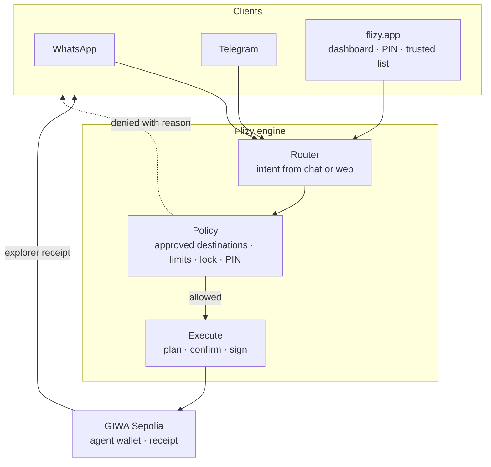
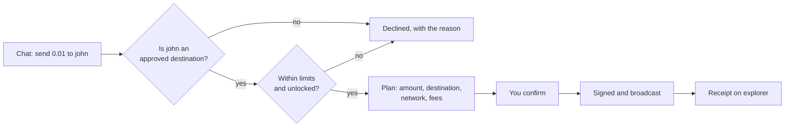
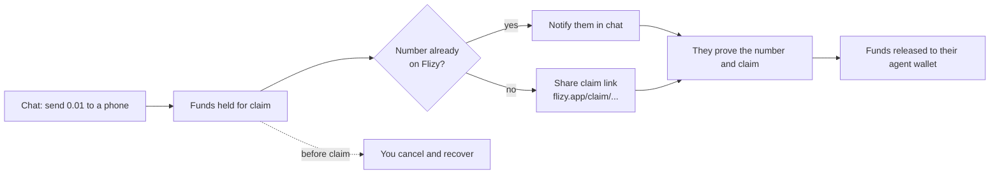
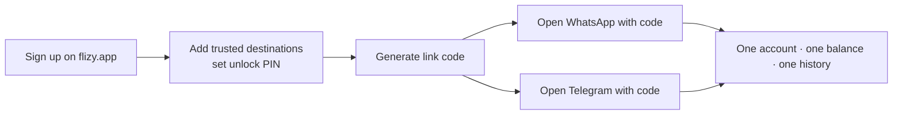

<p align="center">
  
</p>

<h1 align="center">Flizy</h1>

<p align="center">
  <strong>Send crypto from WhatsApp or Telegram, only to destinations you approved in advance.</strong><br />
  A stolen phone cannot add a new payout address, so it cannot drain you.
</p>

<p align="center">
  <a href="https://flizy.app">flizy.app</a>
  ·
  <a href="https://flizy.app/how-it-works">How it works</a>
  ·
  <a href="https://flizy.app/docs">Security</a>
  ·
  <a href="https://x.com/Flizyapp">X</a>
  ·
  <a href="docs/ARCHITECTURE.md">Architecture</a>
  ·
  <a href="docs/OPERATIONS.md">Operations</a>
</p>

<p align="center">
  <em>Live at <a href="https://flizy.app">flizy.app</a> · GIWA Sepolia testnet · Contracts source verified</em>
</p>

---

## The problem

Crypto payments assume a laptop, a browser extension and a seed phrase. Most people who
would actually use them have none of those, and the ones who try get drained by a single
mistake: one wrong address pasted into a chat, one phone picked up while unlocked.

Flizy inverts the default. **Money can only move to a destination you approved earlier, from
a device you already trust.** Approving a new destination requires the website and your
account password. Chat can spend within those rules; it can never rewrite them.

That is the whole product thesis. Everything below serves it.

---

## Two chat apps, one account

Flizy runs on **WhatsApp and Telegram**. The same account, the same balance, the same
approved list, the same history. Link either one, or both, from the dashboard.

| | WhatsApp | Telegram |
| --- | --- | --- |
| Send | `flizy send 0.01 to john` | `/send 0.01 to john` |
| Confirm | reply `confirm` | tap Confirm, or type it |
| Receive to your number | automatic once linked | share your number once with `/phone` |
| Lock this device | `flizy lock` | `/lock` |

Locking one chat app leaves the other exactly as it was, so losing one phone does not lock
you out of your money.

Underneath, both are thin clients on one engine. A chat app translates a message into an
intent and hands it over; it never decides whether the money is allowed to move. Adding a
third channel is an adapter, not a second product.

---

## How it works, for a user

1. **Sign up on the site.** You get an account and an agent wallet address.
2. **Approve who you can pay.** Add a name and an address under trusted destinations. This
   step needs your password, and it only happens on the site.
3. **Link your chat app.** Generate a one-time code, open WhatsApp or Telegram from the
   dashboard, send the code. Only a logged-in account holder can produce a code, which is
   what makes it proof of identity.
4. **Pay from chat.** `flizy send 0.01 to john`. Flizy replies with a plan showing amount,
   destination, network and fees. Nothing moves until you confirm.
5. **Get a receipt** with an explorer link.

You can also send to a **phone number**. The funds go into escrow and you can cancel any
time until they are claimed. If that number is already on Flizy, the owner is notified in
their chat app straight away and claims it there. If it is not, you share a claim link, and
the money becomes theirs once they join and prove the number.

Money never lands in someone's wallet unannounced, and a number that is not on Flizy is
never messaged out of the blue.

---

## Security model

| Control | What it does |
| --- | --- |
| **Approved destinations** | Transfers reach addresses on your list only. The list is managed on the site behind your password, never from chat |
| **Plan then confirm** | Every money action shows a plan first. Amount, destination, network, fees. Nothing executes without an explicit confirm |
| **Fees disclosed up front** | Swap plans show the protocol fee percentage, the fee amount and slippage before you confirm |
| **Per-channel lock** | Lock a chat app instantly. Unlocking needs your PIN or account password, and wrong attempts start blocking unlock for longer and longer. Setting a new PIN on the site, behind your password, clears the block |
| **Limits** | Per-transaction maximum and a daily cap, enforced centrally |
| **Separated keys** | User funds, operational gas and claim escrow use different keys |
| **Verified contracts** | Every deployed contract is source verified on the public explorer |

The rules are enforced in one policy layer that every client goes through. A new chat app
inherits every rule automatically, because it has no way to bypass them. More on the
allowlist in [docs/trusted-addresses.md](docs/trusted-addresses.md).

### Where the product actually is

Being precise about this matters more than sounding finished:

- This is a **testnet product** on GIWA Sepolia. Do not treat it as production custody.
- Agent wallets are currently **server-derived EOAs**. Keys are held server side, so the
  current model is custodial. Session-key smart wallet contracts are in this repo
  (`contracts/src/FlizyWallet.sol`) and are the next custody milestone.
- The approved-destination allowlist is enforced **at the policy layer today**, not yet on
  chain. Moving that enforcement into the smart wallet, so the rule holds even if the
  backend is compromised, is the next security milestone.

---

## Deployed contracts

**Network:** GIWA Sepolia · **Chain ID:** `91342`
**Explorer:** [sepolia-explorer.giwa.io](https://sepolia-explorer.giwa.io)
**Addresses:** [`deployments/giwa-sepolia.json`](deployments/giwa-sepolia.json)

| Contract | Address | Explorer | Source |
|----------|---------|----------|--------|
| **WETH9** | `0x3a13399f2741122B63c7710B2A85346B97C6BFDf` | [View](https://sepolia-explorer.giwa.io/address/0x3a13399f2741122B63c7710B2A85346B97C6BFDf) | Verified |
| **FLZ** (test token, 100k supply, 18 decimals) | `0x308be8f71DA695f18E70D2243a446e1fD1566BA6` | [View](https://sepolia-explorer.giwa.io/address/0x308be8f71DA695f18E70D2243a446e1fD1566BA6) | Verified |
| **UniswapV2Factory** | `0xBB1d2c582E455B448660A199097A54DF29162BbF` | [View](https://sepolia-explorer.giwa.io/address/0xBB1d2c582E455B448660A199097A54DF29162BbF) | Verified |
| **UniswapV2Router02** | `0x4055413A4757e069bbCAc481639EF2814224Faa0` | [View](https://sepolia-explorer.giwa.io/address/0x4055413A4757e069bbCAc481639EF2814224Faa0) | Verified |
| **FlizyFeeRouter** (protocol fee, default 30 bps, max 100 bps) | `0x6427fD0c13577847888B7E2d1A24C887bBEBd9cC` | [View](https://sepolia-explorer.giwa.io/address/0x6427fD0c13577847888B7E2d1A24C887bBEBd9cC) | Verified |
| **FLZ / WETH pair** | `0xEC6Ebf4A7a3088EB22535C9F767B9Ab5845D8227` | [View](https://sepolia-explorer.giwa.io/address/0xEC6Ebf4A7a3088EB22535C9F767B9Ab5845D8227) | Verified |

All six are source verified as a full match, built with `v0.8.24+commit.e11b9ed9`, optimizer
on at 200 runs, EVM version cancun. This is a Solidity 0.8 port of Uniswap V2, so factory,
pair and router build on one compiler rather than the canonical 0.5.16 / 0.6.6 split.

**Treasury / fee destination:** [`0x81Fb7Ed21B9843D2D5C232A7F3e959F91993401B`](https://sepolia-explorer.giwa.io/address/0x81Fb7Ed21B9843D2D5C232A7F3e959F91993401B)
**Seed liquidity:** 1.2 ETH and 60,000 FLZ, starting near 50,000 FLZ per ETH.

Also in the repository, not yet required on chain:

| Contract | Path | Status |
|----------|------|--------|
| FlizyWallet | `contracts/src/FlizyWallet.sol` | Foundry tests; deploys when session-key custody ships |
| FlizyWalletFactory | `contracts/src/FlizyWalletFactory.sol` | CREATE2 factory for future smart wallets |

---

## System design



Every path to money passes through the same policy check. **[flizy.app](https://flizy.app)**
is where trust and PIN are managed; chat is where you send within those rules.

### Sending



### Sending to a phone number



### Link once, use both chats



Detailed implementation diagrams, the adapter model and the identity internals are in
[docs/ARCHITECTURE.md](docs/ARCHITECTURE.md).

---

## Commands

WhatsApp uses the `flizy` prefix. Telegram uses `/command` and also accepts the prefix.
Bare `confirm` and `cancel` work on both.

| Command | Purpose |
|---------|---------|
| `help` | Command list |
| `link CODE` | Bind this chat to your account |
| `me` · `balance` · `deposit` · `history` | Account and wallet |
| `add wallet 0x…` | Start the approved-destination flow |
| `send AMOUNT to name \| 0x… \| phone` | Transfer, or hold a claim for a phone number |
| `claim` · `cancel claims` | Receive or cancel phone claims |
| `request` · `pay` · `requests` | Payment requests |
| `buy AMOUNT FLZ` · `sell AMOUNT FLZ` | Trade against the pool |
| `swap AMOUNT ETH for FLZ` · `price FLZ` | Explicit swap and spot price |
| `confirm` · `cancel` | Execute or drop the pending plan |
| `lock` · `unlock PIN` | Session control, per channel |
| `/phone` | Telegram only: share your number so claims reach you |

### On the site ([flizy.app](https://flizy.app))

| Route | Purpose |
|-------|---------|
| [flizy.app](https://flizy.app/) | Product home |
| [/how-it-works](https://flizy.app/how-it-works) · [/docs](https://flizy.app/docs) | Guides and security |
| [/signup](https://flizy.app/signup) · [/login](https://flizy.app/login) | Account |
| [/dashboard](https://flizy.app/dashboard) | Wallet, history, approved destinations, PIN, link codes |
| [/dashboard/swap](https://flizy.app/dashboard/swap) | Swap and liquidity |
| `/claim/[token]` | Public claim status page |

Swapping is available in chat and on the site. The protocol fee is **0.30%** by default with
a hard maximum of 1%, on top of the standard pool fee, and it is shown in the plan before
you confirm. Details in [docs/swap-fees.md](docs/swap-fees.md).

---

## Roadmap

| Horizon | Focus |
|---------|-------|
| **Now** | GIWA Sepolia: chat payments, phone claims, payment requests, FLZ swap and liquidity, both chat apps live on one engine |
| **Next** | On-chain enforcement of approved destinations through session-key smart wallets, moving the guarantee out of the backend |
| **Then** | More tokens through the pair registry, then more EVM chains through the chain registry. Same policy path, no new AMM |

---

## Repository

```text
index.js · telegram.js    chat clients
lib/                      router, policy engine, identity, claims, swap
web/                      Next.js site and dashboard
contracts/                Solidity sources and Foundry tests
supabase/migrations/      database schema
docs/                     architecture, operations, fee mechanics
```

Configuration is documented in [`.env.example`](.env.example).

### Quickstart

```bash
npm install
cp .env.example .env    # fill in your values
npm start               # WhatsApp client
npm run start:telegram  # Telegram client
npm test
```

Full setup, deployment and configuration reference: [docs/OPERATIONS.md](docs/OPERATIONS.md).

---

## License and contact

Private product repository. Live at [flizy.app](https://flizy.app). On X: [@Flizyapp](https://x.com/Flizyapp).
