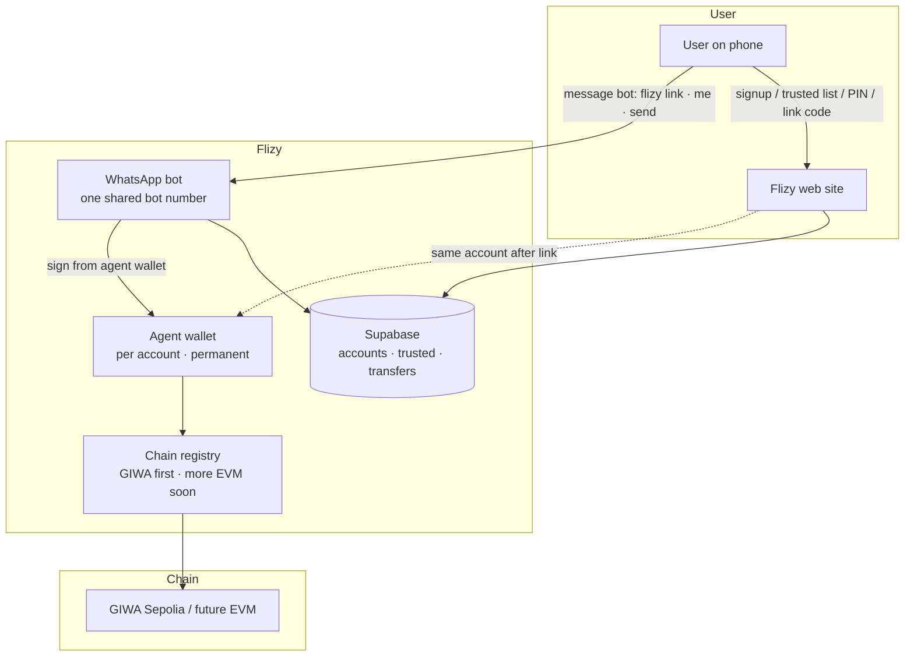
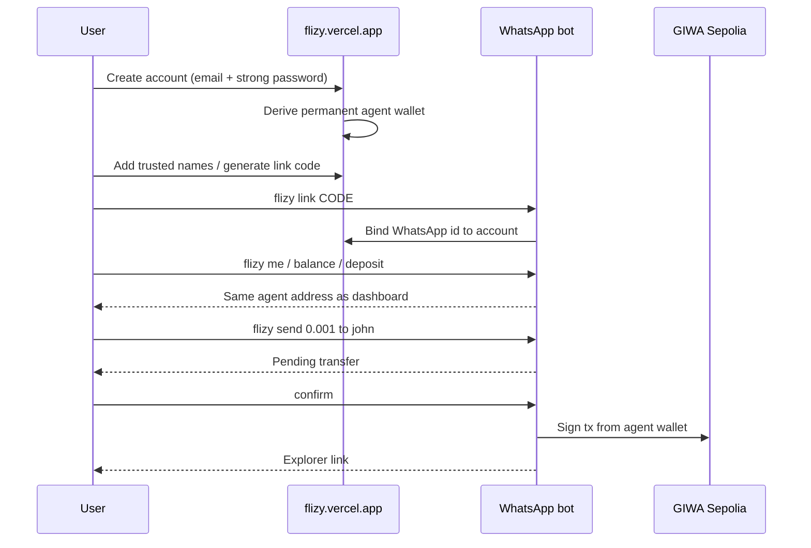

<p align="center">
  
</p>

<h1 align="center">Flizy</h1>

<p align="center">
  <strong>WhatsApp-native EVM wallet.</strong><br />
  Trusted destinations only. GIWA-first. Built to expand across EVM.
</p>

<p align="center">
  <a href="https://flizy.vercel.app">Live site</a>
  ·
  <a href="https://flizy.vercel.app/how-it-works">How it works</a>
  ·
  <a href="https://flizy.vercel.app/docs">Security docs</a>
</p>

---

## What Flizy is

Flizy lets people **send crypto from WhatsApp** without pasting seed phrases into chat. Each user has a permanent **agent wallet** tied to their site account. Money moves only to **trusted destinations** they approve on the web dashboard (or via controlled bot commands). The product launches on **GIWA Sepolia** and is designed so additional EVM chains can be added through the chain registry—not a rewrite.

| Layer | Role |
|--------|------|
| **Web site** | Signup, login, dashboard, trusted list, unlock PIN, WhatsApp link codes, claim pages |
| **WhatsApp bot** | Commands (`flizy …`), confirm flows, balance, history, sends signed from the user’s agent wallet |
| **Supabase** | Accounts, WhatsApp identities, link codes, trusted addresses, transfers, sessions |
| **Contracts** | Smart wallet + CREATE2 factory (Foundry) for future on-chain allowlists and session keys |
| **Ops wallet** | Bot pool key (`PRIVATE_KEY`) for infrastructure; **not** the user’s send address |

---

## Product diagram



### End-to-end flow



---

## What Flizy does today

### Identity and accounts

- Email signup and login on the site (no email verification code; **strong password required**: length, letter, number, special character).
- Permanent **account** row in Supabase; agent wallet address is deterministic from account id (`flizy:agent:v1:{accountId}`) and is **not rotated**.
- **WhatsApp link codes** from the dashboard; `flizy link CODE` binds the observed WhatsApp sender id (including LID) to that account.
- Link-first design so messaging the bot before linking does not become a competing “orphan” wallet for `me` / balance / send after link.

### Agent wallet (user funds)

- Each linked site account has one **agent wallet**.
- Dashboard and WhatsApp (`flizy me`, `flizy balance`, `flizy deposit`) show the **same** address after link.
- User funds that address (faucet / bridge / transfer). Sends are signed from **their** agent wallet, not the bot ops key.

### Trusted destinations

- Users maintain an allowlist of destination addresses (named contacts) on the site and/or via `flizy add wallet`.
- When `ENFORCE_TRUSTED=true`, the bot rejects sends to addresses outside that list.
- Goal: a stolen or hijacked chat cannot invent a new drain destination without site access (plus optional PIN unlock).

### WhatsApp commands

All product commands use the **`flizy` prefix** (configurable). Bare `confirm` / `cancel` work for pending transfers.

| Command | Purpose |
|---------|---------|
| `flizy help` | Command list and chain hint |
| `flizy how` | How friends should use the bot number |
| `flizy link CODE` | Bind this WhatsApp id to a site account |
| `flizy me` | Account summary + permanent agent wallet |
| `flizy balance` | Credit (if enabled) + on-chain holdings on agent wallet |
| `flizy deposit` | Instructions + agent address to fund |
| `flizy history` | Recent transfers |
| `flizy add wallet 0x…` | Start trusted destination; bot asks for a name |
| `flizy send AMOUNT to name` | Queue send to a trusted name |
| `flizy send AMOUNT to 0x…` | Queue send to an address (still subject to trusted policy) |
| `confirm` | Execute pending send |
| `cancel` | Drop pending send |
| `flizy unlock PIN` / `flizy lock` | Session gate when unlock PIN is set on site |
| Admin helpers | `claimadmin`, `credit`, `pool`, `users` (ops only) |

### Web site surfaces

| Route | Purpose |
|-------|---------|
| `/` | Product home |
| `/how-it-works` | Full user guide |
| `/docs` | Why trusted addresses exist |
| `/signup` · `/login` | Account auth |
| `/dashboard` | Agent wallet, PIN, trusted people, WhatsApp link code, Open WhatsApp |
| `/claim/[token]` | Claim path for recipients who are not yet users |

### Security model (product)

- No private keys or seed phrases in WhatsApp messages.
- Agent keys derived server-side from account id (testnet custody model); ops `PRIVATE_KEY` is separate.
- Trusted-list enforcement on the bot path.
- Optional session unlock PIN with TTL.
- Password re-check for sensitive dashboard mutations (e.g. remove trusted).
- Secrets only in environment variables (`.env` on bot host; Vercel env for site).

### Infrastructure

- **Site:** Next.js App Router, deployed on Vercel (`web/` root directory).
- **Bot:** Node.js + `whatsapp-web.js` (Puppeteer); intended always-on host (e.g. VPS + `screen` / process manager).
- **Data:** Supabase migrations under `supabase/migrations/`.
- **Contracts:** Foundry `FlizyWallet` + `FlizyWalletFactory` (CREATE2) for the next custody phase.

---

## Multichain roadmap

Flizy is **GIWA-first** today (`lib/chains.js` registry, default `giwa_sepolia` / chain id `91342`).

| Status | Scope |
|--------|--------|
| **Live** | GIWA Sepolia: RPC, explorer, native ETH sends via agent wallet |
| **In repo** | Chain registry abstraction; per-chain env overrides for RPC / explorer / DEX placeholders |
| **Soon** | Additional EVM networks registered the same way—config entry, not a bot rewrite |
| **Later** | Per-chain agent deployment / factory deploy, DEX buy path when routers are configured |

Adding a chain is intended to mean: register RPC + chain id + explorer (+ optional DEX), set `DEFAULT_CHAIN` or user-selected chain—not forking the product.

---

## Repository layout

| Path | Purpose |
|------|---------|
| `index.js` | WhatsApp bot entry |
| `lib/` | Agent wallet, identity, trusted, session, holdings, chains, password policy, transfer log |
| `web/` | Next.js site |
| `contracts/` | Foundry smart wallet + factory |
| `supabase/migrations/` | Database schema |
| `docs/` | Extra product notes |
| `.env.example` | Bot env template (no real secrets) |

---

## Architecture (components)

```text
                    +------------------+
                    |  flizy.vercel.app |
                    |  Next.js (web/)   |
                    +--------+---------+
                             |
                             v
                    +------------------+
                    |     Supabase     |
                    | accounts, WA ids |
                    | trusted, txs     |
                    +--------+---------+
                             ^
                             |
  +----------+        +------+-------+        +----------------+
  |  User WA | -----> |  Flizy bot   | -----> | Agent wallets  |
  |  phones  |        |  index.js    | sign   | (per account)  |
  +----------+        |  whatsapp-web|        +--------+-------+
                      +------+-------+                 |
                             |                         v
                      ops key only               EVM chain(s)
                      (pool / infra)             GIWA → + more
```

---

## Setup

### Prerequisites

- Node.js **22+** (required for current Supabase client / native WebSocket)
- Supabase project
- WhatsApp account for the **bot number** (linked device QR)
- Optional: Foundry for contracts

### Bot (local or VPS)

```bash
# clone and install
cd /path/to/flizy
cp .env.example .env   # or copy .env.example on Windows
# edit .env: SUPABASE_URL, SUPABASE_KEY, GIWA_RPC, PRIVATE_KEY, BOT_WHATSAPP_NUMBER, SITE_URL

npm install
node index.js
```

Scan the QR with the bot phone (Linked devices). Leave the process running on an always-on host (`screen -S flizy` recommended on Linux VPS).

**Windows CMD** (dev only):

```cmd
cd /d C:\Users\Ludarep\flizy
npm.cmd install
node index.js
```

Do not run the same WhatsApp session on Windows and VPS at the same time.

### Site

```bash
cd web
npm install
npm run dev
```

Production: deploy `web/` to Vercel (framework Next.js). Set the same public site URL in bot `SITE_URL`.

### Database

```bash
npx supabase db push
```

(or apply migrations from `supabase/migrations/` via your usual Supabase workflow)

### Contracts

```bash
cd contracts
forge install foundry-rs/forge-std
forge test
```

---

## Environment (bot)

| Variable | Purpose |
|----------|---------|
| `SUPABASE_URL` / `SUPABASE_KEY` | Database (service role on bot) |
| `GIWA_RPC` | GIWA Sepolia RPC |
| `PRIVATE_KEY` | Bot **ops** hot wallet (not user agent keys) |
| `BOT_WHATSAPP_NUMBER` | Digits for dashboard deep links (e.g. `234…`) |
| `SITE_URL` | e.g. `https://flizy.vercel.app` |
| `REQUIRE_FLIZY_PREFIX` | Require `flizy` on commands (default true) |
| `ENFORCE_TRUSTED` | Block non-allowlisted destinations |
| `ENFORCE_CREDIT` | Optional spendable credit gate |
| `REQUIRE_UNLOCK` | Optional PIN session gate |
| `DEFAULT_CHAIN` | Registry key (default `giwa_sepolia`) |

See `.env.example` for the full list. Never commit real `.env` files.

---

## Hard rules

- No secrets in WhatsApp, logs, or client bundles.
- User-facing sends use the **agent wallet**, not the ops key, after site link.
- Trusted destinations are first-class; untrusted sends are rejected when enforcement is on.
- Commands use the `flizy` prefix in production configuration.
- Visual system: near-black surfaces, paper text, accent lime `#c8f135` or gold `#f5c842`—no blue chrome.

---

## Status

| Area | State |
|------|--------|
| Site identity + dashboard + link codes | Live |
| WhatsApp multi-user bot + agent wallet sends | Live (GIWA Sepolia) |
| Trusted list enforcement | Live |
| Password policy (no email verify) | Live |
| Chain registry for more EVM | Ready; GIWA registered |
| Smart wallet deploy on chain | Contracts in repo; deploy when ready |
| DEX / buy commands | Helpers present; wire when router env known |
| Always-on bot host | Operator-managed (e.g. Contabo + screen) |

---

## License and contact

Private product repository. Site: [https://flizy.vercel.app](https://flizy.vercel.app).

For operators: keep the bot process supervised, rotate compromised keys immediately, and treat `PRIVATE_KEY` and Supabase service keys as production secrets.
