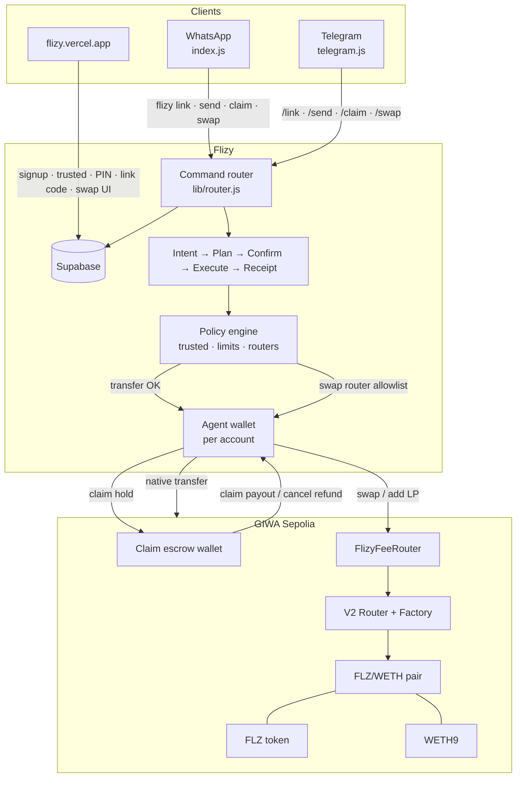
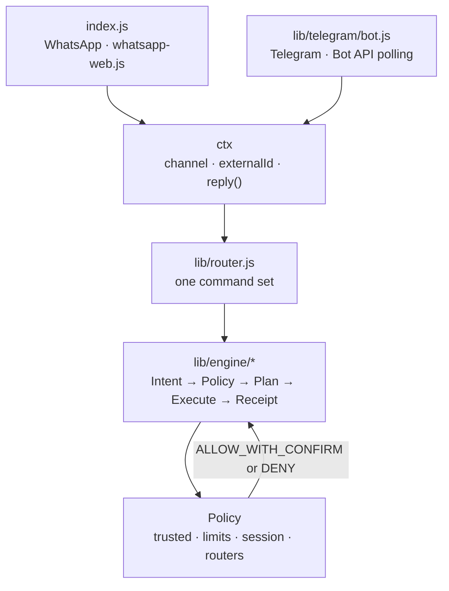
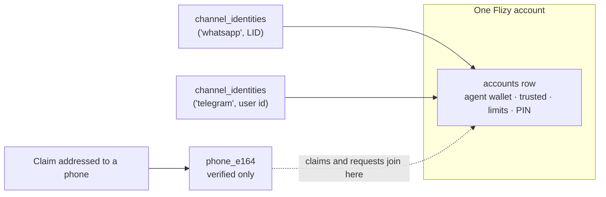
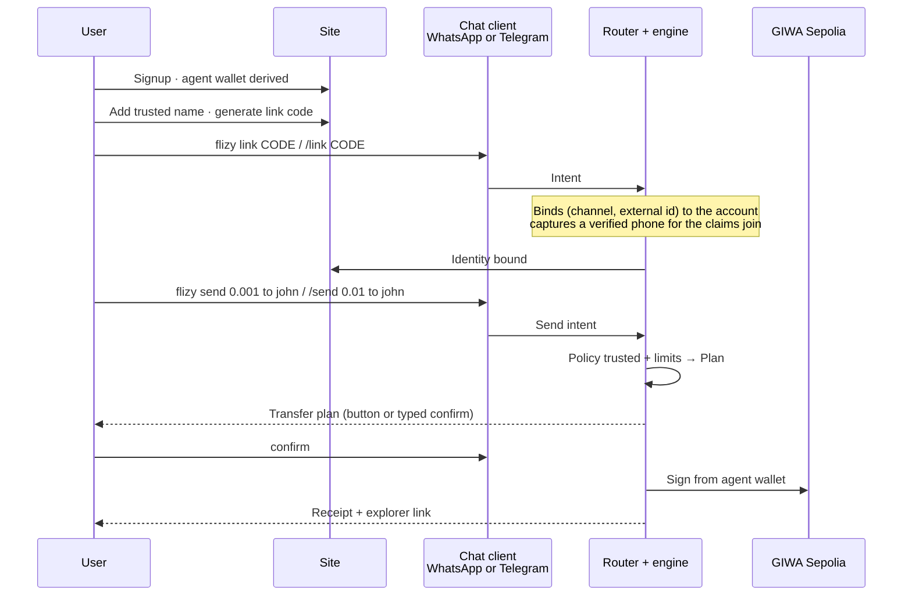
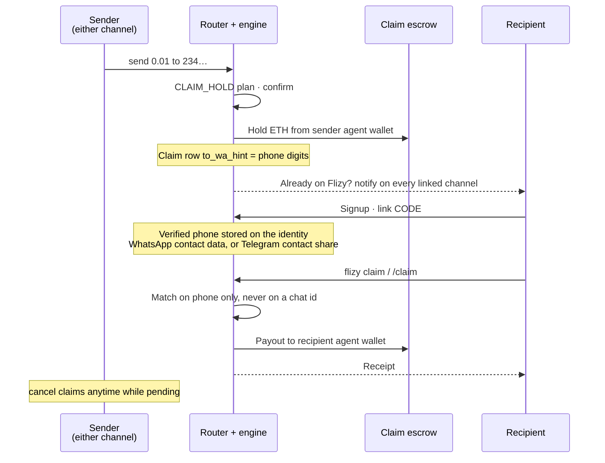
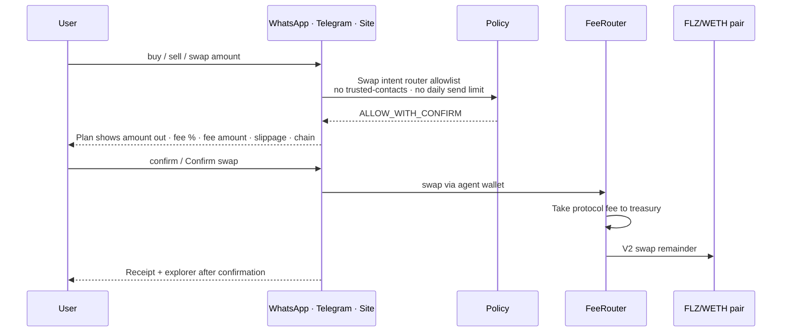
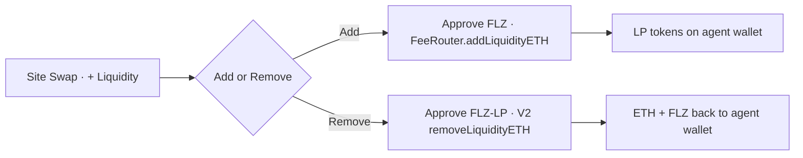

<p align="center">
  
</p>

<h1 align="center">Flizy</h1>

<p align="center">
  <strong>Chat-native EVM wallet and swap. WhatsApp and Telegram, one account.</strong><br />
  Trusted destinations only. GIWA-first. Built to expand across EVM.
</p>

<p align="center">
  <a href="https://flizy.vercel.app">Live site</a>
  ·
  <a href="https://flizy.vercel.app/how-it-works">How it works</a>
  ·
  <a href="https://flizy.vercel.app/docs">Security docs</a>
  ·
  <a href="docs/swap-fees.md">Swap fees</a>
</p>

---

## What Flizy is

Flizy lets people **send and swap crypto from the chat app they already use** — WhatsApp or Telegram — and from the site, without pasting seed phrases into chat. Each user has a permanent **agent wallet** tied to their site account. Transfers move only to **trusted destinations** they approve. Swaps go only through **allowlisted DEX routers**. Phone claims hold funds in escrow until the recipient links Flizy. The product launches on **GIWA Sepolia** and is designed so additional EVM chains, tokens and chat channels can be added through config and adapters, not a rewrite.

| Layer | Role |
|--------|------|
| **Web site** | Signup, dashboard, trusted list, PIN, link codes, claim pages, **Swap + liquidity** |
| **Chat clients** | WhatsApp (`flizy …`) and Telegram (`/…`). Adapters only: they build an Intent and hand it to the engine |
| **Command router** | One command set shared by every channel (`lib/router.js`) |
| **Supabase** | Accounts, channel identities (+ phone join key), trusted, transfers, claims, requests |
| **DEX contracts** | Uniswap V2-style factory/router, fee router, WETH, FLZ token, FLZ/WETH pair (GIWA Sepolia) |
| **Wallet contracts** | `FlizyWallet` + CREATE2 factory in repo (next custody phase; not required for current agent EOA) |
| **Ops wallet** | Gas / infra + protocol fee treasury (`PRIVATE_KEY`); not the user’s send address |
| **Escrow wallet** | Holds pending phone claims until claim or cancel |

---

## Deployed contracts (GIWA Sepolia)

**Network:** GIWA Sepolia · **Chain ID:** `91342`  
**Explorer base:** [https://sepolia-explorer.giwa.io](https://sepolia-explorer.giwa.io)  
**Full JSON:** [`deployments/giwa-sepolia.json`](deployments/giwa-sepolia.json)

| Contract | Address | Explorer | Source |
|----------|---------|----------|--------|
| **WETH9** | `0x3a13399f2741122B63c7710B2A85346B97C6BFDf` | [View](https://sepolia-explorer.giwa.io/address/0x3a13399f2741122B63c7710B2A85346B97C6BFDf) | Verified |
| **FLZ** (Flizy test token, 100k supply, 18 decimals) | `0x308be8f71DA695f18E70D2243a446e1fD1566BA6` | [View](https://sepolia-explorer.giwa.io/address/0x308be8f71DA695f18E70D2243a446e1fD1566BA6) | Verified |
| **UniswapV2Factory** | `0xBB1d2c582E455B448660A199097A54DF29162BbF` | [View](https://sepolia-explorer.giwa.io/address/0xBB1d2c582E455B448660A199097A54DF29162BbF) | Verified |
| **UniswapV2Router02** | `0x4055413A4757e069bbCAc481639EF2814224Faa0` | [View](https://sepolia-explorer.giwa.io/address/0x4055413A4757e069bbCAc481639EF2814224Faa0) | Verified |
| **FlizyFeeRouter** (protocol fee, default 30 bps, max 100 bps) | `0x6427fD0c13577847888B7E2d1A24C887bBEBd9cC` | [View](https://sepolia-explorer.giwa.io/address/0x6427fD0c13577847888B7E2d1A24C887bBEBd9cC) | Verified |
| **FLZ / WETH pair** | `0xEC6Ebf4A7a3088EB22535C9F767B9Ab5845D8227` | [View](https://sepolia-explorer.giwa.io/address/0xEC6Ebf4A7a3088EB22535C9F767B9Ab5845D8227) | Verified |

**Treasury / fee destination (ops):** `0x81Fb7Ed21B9843D2D5C232A7F3e959F91993401B`  
[View treasury](https://sepolia-explorer.giwa.io/address/0x81Fb7Ed21B9843D2D5C232A7F3e959F91993401B)

**Seed liquidity (testnet):** 1.2 ETH + 60,000 FLZ (starting ~50,000 FLZ per 1 ETH).  
**Source:** `contracts/src/dex/*` · deploy script `contracts/script/DeployDex.s.sol`

All six are source verified on the explorer as a full match, built with
`v0.8.24+commit.e11b9ed9`, optimizer on at 200 runs, EVM version cancun. This is a
Solidity 0.8 port of Uniswap V2, so Factory, Pair and Router02 all build on one compiler
rather than the canonical 0.5.16 / 0.6.6 split.

### Contracts in repo (not required on-chain for current bot)

| Contract | Path | Status |
|----------|------|--------|
| FlizyWallet | `contracts/src/FlizyWallet.sol` | Foundry tests; deploy when session-key custody ships |
| FlizyWalletFactory | `contracts/src/FlizyWalletFactory.sol` | CREATE2 factory for future smart wallets |

---

## Product architecture



### Component map

```text
                    +------------------------+
                    |   flizy.vercel.app     |
                    |  dashboard · swap UI   |
                    |  liquidity add/remove  |
                    +-----------+------------+
                                |
                                v
                    +--------------------------+
                    |        Supabase          |
                    | accounts · identities    |
                    | (channel, external id)   |
                    | trusted · claims · txs   |
                    +-----------+--------------+
                                ^
                                |
  +------------+       +--------+--------+         +------------------+
  | WhatsApp   | ----> |  Flizy engine   | ----->  | Agent wallets    |
  | Telegram   |       |  Policy + Plan  |  sign   | (per account)    |
  +------------+       +--------+--------+         +--------+---------+
                                |                           |
                     ops / treasury / escrow                v
                                                    GIWA Sepolia DEX
                                                    FeeRouter → V2 → Pair
```

### Clients

Chat clients are adapters. They translate a message into a ctx and hand it to
`lib/router`, which owns every command. Money rules live only in `lib/engine`.
Adding a channel means adding an adapter, not a second copy of the product.



| | WhatsApp | Telegram |
| --- | --- | --- |
| Process | `node index.js` (`flizy.service`) | `node telegram.js` (`flizy-telegram.service`) |
| Transport | whatsapp-web.js + headless Chromium | Bot API long polling, no browser |
| Invocation | `flizy <command>` | `/command` (the `flizy ` prefix also works) |
| Confirm | type `confirm` | inline button, or type `confirm` |
| Phone for claims | read from WhatsApp contact metadata | one-tap contact share (`/phone`) |

### Identity model

An account can hold a WhatsApp identity and a Telegram identity at once. One phone maps to
exactly one account across every channel, checked in the app for a clear message and
enforced again by a database trigger.



Two rules do the heavy lifting:

- The chat id identifies the **session**. The phone identifies the **claim address**. They
  are never interchangeable, so a Telegram user id can never match a stranger's claim.
- A phone is only accepted from a channel-verified source: WhatsApp contact metadata, or a
  Telegram contact share where `contact.user_id` equals the sender. A typed number is never
  a claim key.

---

## End-to-end flows

### 1. Account link and trusted send



The client differs only in how the message arrives and how the confirm is tapped. The
Intent, the Policy decision, the Plan and the receipt are the same objects either way.

### 2. Phone claim (escrow)



A claim is addressed to a **phone number**, not to a channel. Whoever owns that number can
redeem it from WhatsApp or Telegram, whichever they linked. If the number is not on Flizy
yet, nobody is cold-messaged: the sender shares the claim link as before.

### 3. Swap (any chat client or the site)



### 4. Liquidity (site only)



---

## What Flizy does today

### Identity and accounts

- Email signup / login; strong password policy.
- Permanent account; agent wallet derived once (`flizy:agent:v1:{accountId}`), not rotated.
- One-time link codes; `flizy link CODE` (WhatsApp) or `/link CODE` (Telegram) binds a chat identity. Only a logged-in account holder can generate a code, which is what makes it identity proof.
- Identity is **(channel, external id)** in `channel_identities`: WhatsApp is the observed sender id (**LID-first**), Telegram is the numeric user id. One account can hold both.
- **Phone join key** on `channel_identities.phone_e164` for claims/requests (normalized digits). The chat id stays the identity; the phone is only the claim address match, and one phone maps to exactly one account across every channel.
- Phone is only ever accepted from a channel-verified source: WhatsApp contact metadata, or a Telegram contact share where `contact.user_id` equals the sender. A typed number is never a claim key.

### Agent wallet

- Dashboard and WhatsApp show the same address after link.
- User funds the agent wallet; sends and swaps sign from that wallet (not ops).

### Trusted destinations

- Site and `flizy add wallet` manage allowlist.
- When `ENFORCE_TRUSTED=true`, transfers outside the list are denied by **Policy** (not the client UI alone).

### Claims and payment requests

- Send to a phone → escrow hold → recipient `flizy claim` after link.
- `flizy cancel claims` anytime while pending.
- `flizy request` / `flizy pay` use the same phone join key as claims.

### Swap and FLZ

- Site: Uniswap-style UI (pay / flip / receive), fee disclosure, **+ Liquidity** (add and remove).
- WhatsApp: `flizy buy`, `sell`, `swap`, `price` with plan → confirm → receipt.
- Protocol fee default **0.30%** (30 bps), hard max **1%**, paid to treasury; plus V2 pool fee. Details: [`docs/swap-fees.md`](docs/swap-fees.md).
- Swaps do **not** use trusted-contacts checks and do **not** count against daily send limit.

### Chat commands

WhatsApp uses the **`flizy` prefix** (configurable). Telegram uses `/command`,
and also accepts the `flizy ` prefix. Bare `confirm` / `cancel` work on both.

| Command | Purpose |
|---------|---------|
| `flizy help` | Command list |
| `flizy link CODE` | Bind this chat to your site account |
| `flizy me` / `balance` / `deposit` / `history` | Account and wallet |
| `flizy add wallet 0x…` | Trusted destination flow |
| `flizy send AMOUNT to name\|0x\|phone` | Transfer or phone claim hold |
| `flizy claim` / `flizy cancel claims` | Receive or cancel phone claims |
| `flizy request` / `pay` / `requests` | Payment requests |
| `flizy buy AMOUNT FLZ` | Spend ETH for FLZ |
| `flizy sell AMOUNT FLZ` | Sell FLZ for ETH |
| `flizy swap AMOUNT ETH for FLZ` | Explicit pair swap |
| `flizy price FLZ` | Pool spot price |
| `confirm` / `cancel` | Execute or drop pending plan |
| `flizy unlock PIN` / `lock` | Session when PIN is set (per channel) |
| `/phone` | Telegram only: share your number so claims reach you |

### Web site surfaces

| Route | Purpose |
|-------|---------|
| `/` | Product home |
| `/how-it-works` · `/docs` | Guides |
| `/signup` · `/login` | Auth |
| `/dashboard` | Home, wallet, history, account, link code |
| `/dashboard/swap` | Swap UI + liquidity add/remove |
| `/claim/[token]` | Public claim status page |

### Security model

- No private keys or seeds in WhatsApp.
- Agent keys server-side (testnet custody); ops and escrow keys separate.
- Policy-only money rules (trusted, limits, router allowlist).
- Optional unlock PIN; secrets only in env (bot host + Vercel).

### Infrastructure

- **Site:** Next.js (`web/`) on Vercel.
- **Bot:** Node + `whatsapp-web.js`; systemd on VPS recommended (`deploy/flizy.service`).
- **Data:** `supabase/migrations/`.
- **Contracts:** Foundry under `contracts/` (DEX live; smart wallet next).

---

## Multichain and multi-token roadmap

Flizy is **GIWA-first** (`lib/chains.js`, default `giwa_sepolia` / `91342`).

| Status | Scope |
|--------|--------|
| **Live** | GIWA Sepolia: agent sends, claims, requests, FLZ swap + LP |
| **In repo** | Chain registry + DEX addresses (env or `deployments/*.json`) |
| **Next tokens** | Token + pair registry (symbol → address → pair); UI picker; not a new AMM |
| **More EVM** | Register RPC, explorer, fee router, tokens; same Policy/Plan path |

---

## Repository layout

| Path | Purpose |
|------|---------|
| `index.js` | WhatsApp client (adapter) |
| `telegram.js` | Telegram client entrypoint (adapter) |
| `lib/router.js` | Channel-agnostic command router: every command lives here once |
| `lib/telegram/` | Bot API client and update loop |
| `lib/notify.js` | Cross-channel notifications + outbox drain |
| `lib/runtime.js` | Shared chain, provider, ops and escrow wallets |
| `lib/` | Identity, claims, phone, engine, dex, chains, agent wallet, escrow |
| `lib/engine/` | Intent · Policy · Plan · Execute · Receipt |
| `web/` | Next.js site + swap API |
| `contracts/src/dex/` | WETH, FLZ, V2 factory/pair/router, fee router |
| `contracts/src/` | FlizyWallet + factory |
| `deployments/` | Live addresses (GIWA Sepolia) |
| `supabase/migrations/` | Schema |
| `docs/` | Swap fees, trusted addresses |
| `deploy/` | systemd units (WhatsApp + Telegram) |
| `.env.example` | Bot env template |

---

## Setup

### Prerequisites

- Node.js **18+** (22+ recommended)
- Supabase project
- WhatsApp for the bot number (linked device)
- Foundry optional (contracts)

### Bot (local or VPS)

```bash
cd /path/to/flizy
cp .env.example .env
# fill SUPABASE_*, GIWA_RPC, PRIVATE_KEY, BOT_WHATSAPP_NUMBER, SITE_URL
npm install
node index.js
```

### Telegram client

Separate process, same code, same database, same wallets:

```bash
cp .env.example .env
# add TELEGRAM_BOT_TOKEN (from @BotFather) and TELEGRAM_BOT_USERNAME
node telegram.js
```

Long polling, so no public URL and no inbound port. Only one process may poll a
token at a time; a second poller makes Telegram answer 409 and both stall.

VPS with systemd:

```bash
cd /opt/flizy && git pull && npm install --omit=dev
sudo systemctl restart flizy flizy-telegram
journalctl -u flizy -f
journalctl -u flizy-telegram -f
```

Two units on purpose: WhatsApp drives headless Chromium and is the fragile half,
and a Chromium crash must not take Telegram payments down with it. See
[`deploy/README-systemd.md`](deploy/README-systemd.md).

Do not run the same WhatsApp session on Windows and VPS at once.

### Site

```bash
cd web
npm install
npm run dev
```

Production: deploy `web/` to Vercel.

### Database

```bash
npx supabase db push
```

Or apply SQL from `supabase/migrations/`.

### Contracts

```bash
cd contracts
forge install foundry-rs/forge-std
forge test
# redeploy DEX only if needed:
# node ../scripts/deploy-dex.js
```

---

## Environment (bot)

| Variable | Purpose |
|----------|---------|
| `SUPABASE_URL` / `SUPABASE_KEY` | Database (service role on bot) |
| `GIWA_RPC` | GIWA Sepolia RPC |
| `PRIVATE_KEY` | Ops / treasury hot wallet |
| `ESCROW_PRIVATE_KEY` | Optional dedicated claim escrow |
| `BOT_WHATSAPP_NUMBER` | Digits for `wa.me` deep links |
| `TELEGRAM_BOT_TOKEN` | Telegram client. Never commit it, never log it |
| `TELEGRAM_BOT_USERNAME` | Bot username (no `@`) for `t.me/…?start=CODE` links. Also set on Vercel for the dashboard button |
| `SITE_URL` | Public site URL |
| `ENFORCE_TRUSTED` | Trusted-list on transfers |
| `SWAP_FEE_BPS` / `SWAP_SLIPPAGE_BPS` | Defaults for display and quotes |
| `CHAIN_GIWA_SEPOLIA_*` | Optional overrides for WETH, routers, FLZ, pair |
| `FLIZY_TREASURY` | Fee destination (defaults to ops) |

See `.env.example`. Never commit real `.env` files.

---

## Hard rules

- No secrets in any chat, logs, or client bundles. That includes the Telegram bot token.
- User sends and swaps use the **agent wallet**, not the ops key, after link.
- Transfers: trusted destinations when enforcement is on.
- Swaps: allowlisted routers only; fee disclosed before confirm.
- Claims match on **normalized phone**, never on a chat id alone. A Telegram user id is not a phone number.
- One phone maps to exactly one account, across every channel.
- Chat clients are adapters. A client never enforces a money rule; Policy does.

---

## Status

| Area | State |
|------|--------|
| Site identity + dashboard + link codes | Live |
| WhatsApp multi-user bot + agent sends | Live (GIWA Sepolia) |
| Telegram client on the same engine | Built; needs migration applied + service started |
| Channel-agnostic identity (WhatsApp + Telegram on one account) | Built; needs migration applied |
| Trusted list + daily limits (Policy) | Live |
| Phone claims + escrow + cancel | Live |
| Payment requests | Live |
| Phone join key for LID sessions | Live |
| DEX + FLZ + fee router | **Live** on GIWA Sepolia |
| Site swap + add/remove liquidity | Live |
| WhatsApp buy / sell / swap / price | Live |
| Smart wallet deploy | Contracts in repo; not required for current EOAs |
| More tokens / more EVM | Registry-ready; FLZ is first listed asset |

---

## License and contact

Private product repository. Site: [https://flizy.vercel.app](https://flizy.vercel.app).

Operators: supervise the bot process, rotate compromised keys immediately, and treat `PRIVATE_KEY`, escrow keys, and Supabase service keys as production secrets.
