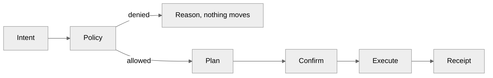
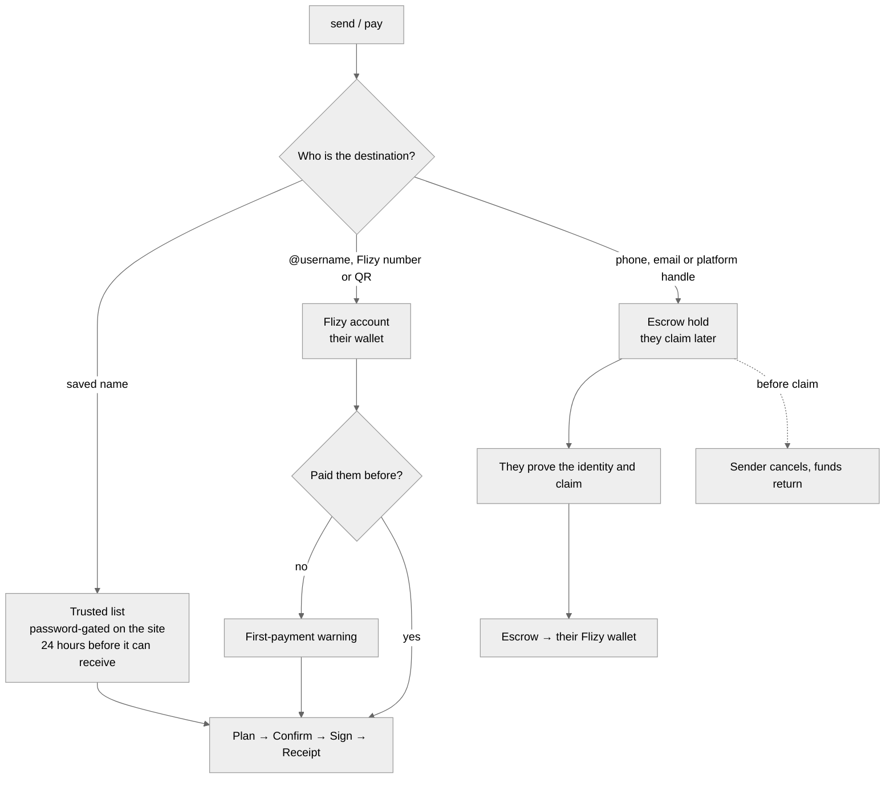
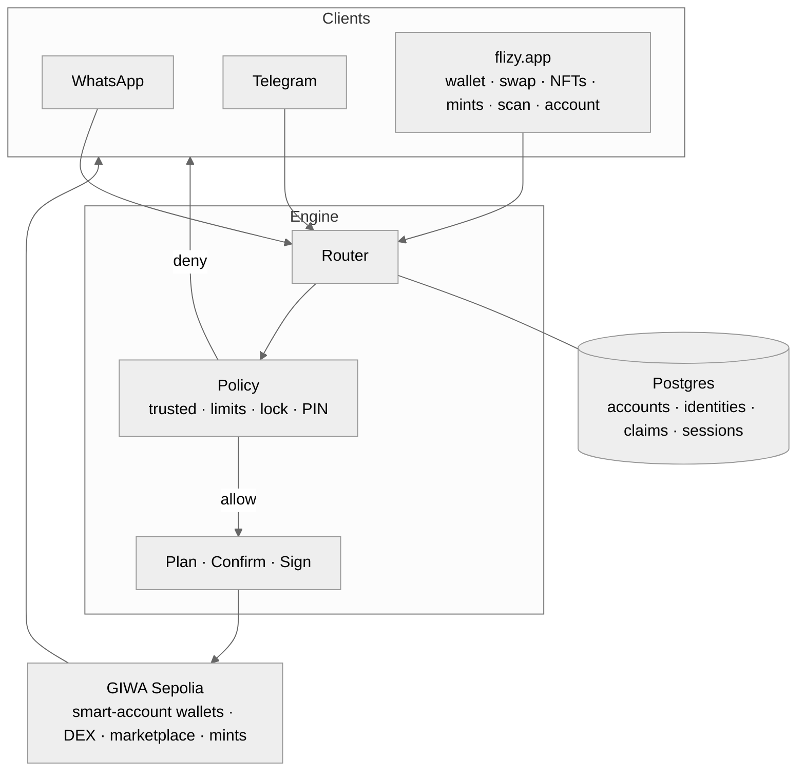
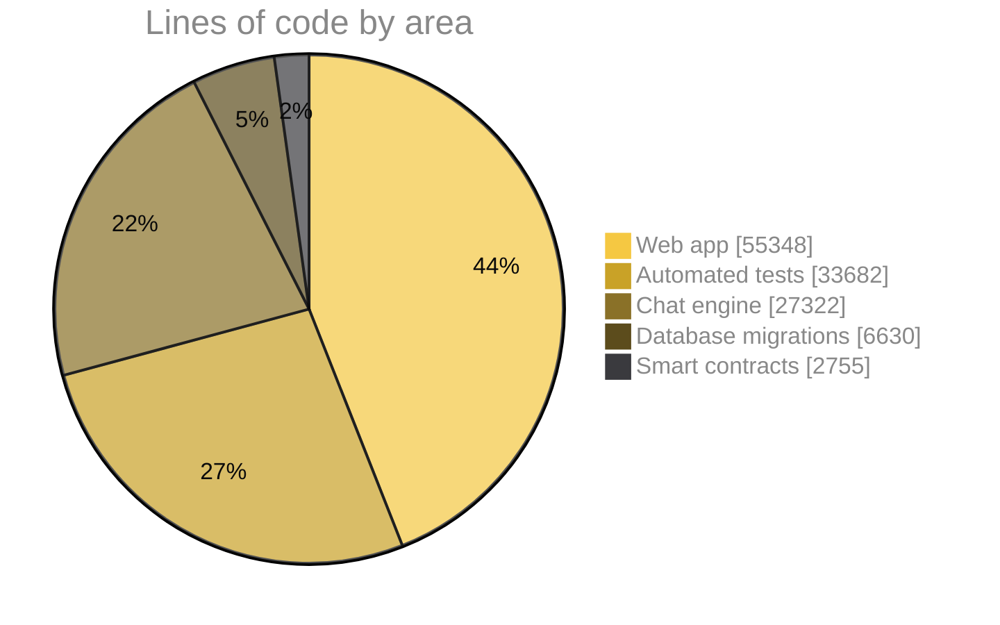
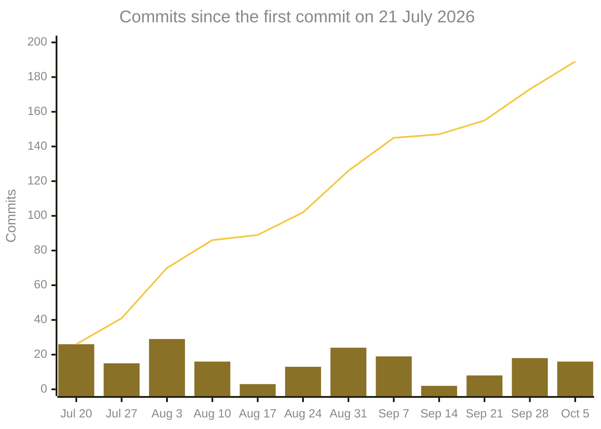

<p align="center">
  
</p>

<h1 align="center">Flizy</h1>

<p align="center">
  <strong>Send crypto the way you send a message.</strong><br />
  Payments, NFTs and trading from WhatsApp, Telegram and the web,<br />
  where money can only move to destinations you approved.
</p>

<p align="center">
  <a href="https://flizy.app">flizy.app</a>
  ·
  <a href="https://flizy.app/how-it-works">How it works</a>
  ·
  <a href="https://flizy.app/docs">Security</a>
  ·
  <a href="https://x.com/Flizyapp">X</a>
  ·
  <a href="docs/ARCHITECTURE.md">Architecture</a>
  ·
  <a href="docs/OPERATIONS.md">Operations</a>
</p>

<p align="center">
  Live at <a href="https://flizy.app">flizy.app</a> · GIWA Sepolia testnet · 14 contracts deployed and source verified
</p>

---

## Contents

- [At a glance](#at-a-glance)
- [The problem](#the-problem)
- [The product](#the-product)
- [What is live today](#what-is-live-today)
- [How money moves](#how-money-moves)
- [Business model](#business-model)
- [Security model](#security-model)
- [Architecture](#architecture)
- [Engineering](#engineering)
- [Contracts](#contracts)
- [Using Flizy](#using-flizy)
- [Roadmap](#roadmap)
- [Repository](#repository)

---

## At a glance

| | |
| --- | --- |
| **What** | A crypto wallet you use from chat apps and the web, built so a single mistake cannot drain it |
| **Who** | People who already pay each other in WhatsApp and Telegram, and the creators and projects they follow |
| **How** | One policy engine behind every channel. Chat can spend inside your rules; only the website, behind your password, can change them |
| **Where** | Live on [flizy.app](https://flizy.app), WhatsApp and Telegram, settling on GIWA Sepolia (testnet) |
| **Earns from** | Swap protocol fee, NFT marketplace fee, paid-mint fee, collection generation fee |
| **Built** | 100 API routes, 73 database migrations, 14 verified contracts, 2,607 automated tests passing |

---

## The problem

Crypto payments still assume a laptop, a browser extension and a seed phrase. Most people
who would use them have none of those, and the ones who try lose money to one slip: a wrong
address pasted into a chat, an approval they did not read, a phone picked up while unlocked.

Wallets answer this with more warnings. Flizy answers it with a different default.

**Money can only move to a destination you approved earlier, from a device you already
trust.** Approving a new destination takes the website and your account password, and a
new destination cannot receive anything for its first 24 hours. Chat can spend inside
those rules. It can never rewrite them.

---

## The product

One account, one balance, one approved list, one history, reachable from three places.

| | WhatsApp | Telegram | flizy.app |
| --- | --- | --- | --- |
| Send to a saved name | `flizy send 0.01 to john` | `/send 0.01 to john` | Not on the site, by design |
| Pay a Flizy account | `flizy pay 0.01 to @ludarep` | `/pay 0.01 to @ludarep` | Pay link or QR |
| Send to a phone, email or handle | `flizy send 0.01 to +234...` | `/send 0.01 to @name on telegram` | Claim a hold sent to you |
| Swap | `flizy swap 0.1 ETH for FLZ` | `/swap 0.1 ETH for FLZ` | Swap, liquidity, limit orders |
| NFTs | `flizy send giwaforge to john` | `/send giwaforge to john` | Marketplace, mints, creator |
| Confirm | reply `confirm` | tap Confirm | account password |
| Lock this device | `flizy lock` | `/lock` | sign out |

The site deliberately cannot send to an arbitrary address: funds leave only through a linked
chat app to a trusted destination, through a payment to a Flizy account, or through a claim.
A password alone never unlocks "any address".

Chat apps are thin clients on one engine. A message becomes an intent, the engine decides
whether money may move, and nothing executes without an explicit confirm. A new channel is
another adapter, not a second product.

---

## What is live today

| Area | What a person can do | Status |
| --- | --- | --- |
| **Chat payments** | Send ETH, FLZ and NFTs from WhatsApp or Telegram, with a plan and a confirm for every move | Live |
| **Pay by identity** | Pay a Flizy `@username`, a 9-digit Flizy number, or a scanned QR. First payments are flagged | Live |
| **Escrow claims** | Send to a phone, email, GitHub, Discord or Telegram identity. Funds wait in escrow until the owner proves that identity; the sender can cancel until then | Live (X identities: linking paused) |
| **Pay me** | A personal QR, Flizy number and pay link, printable | Live |
| **Swap and liquidity** | Trade ETH against FLZ, IZY, MAKI or DCAT, and add liquidity to any of those pools, with fees and slippage shown before confirm | Live |
| **Listed tokens** | FLZ, IZY and MAKI are verified; DCAT is listed. Each trades against an ETH pool Flizy seeded and shows in Explore, Home and the wallet. Only ETH and FLZ can be sent on socials | Live |
| **Limit orders** | Place an FLZ buy or sell at a price; a watcher fills it when the pool reaches it | Live |
| **NFT marketplace** | Browse collections, list, buy, make and accept offers, with creator royalties up to 10% | Live |
| **Mints** | Launch a drop with public and allowlist phases, prices, limits and schedule; bring an existing collection | Live |
| **Collection creator** | Build a collection from artwork layers: traits, rarity weights, rules, unique combinations, standard metadata | Built: the creator runs today; launching switches on once the updated factory and storage are configured |
| **Generate with AI** | Describe a collection; AI plans the traits and draws each layer, then the creator takes over | Built: switches on once AI and storage keys are configured |
| **Scan** | A public ledger of Flizy activity. Recipients show as the payment rail, and each person chooses whether their username appears | Live |
| **Tasks and projects** | Publish tasks with a declared reward; participants submit, the creator picks winners | Live (reward escrow comes later) |
| **Copy trade** | Choose wallets to follow and set dollar rules | Settings only; nothing copies yet |
| **Account and security** | Trusted wallets, unlock PIN, daily ETH limit, password change that signs out other devices, chat links, platform identities, privacy controls | Live |

---

## How money moves

Every path through Flizy is the same six steps. Chat, the site and any future channel all
run through this spine.


```mermaid
%%{init: {'theme': 'neutral'}}%%
flowchart LR
  A[Intent] --> B[Policy]
  B -->|denied| X[Reason, nothing moves]
  B -->|allowed| C[Plan]
  C --> D[Confirm]
  D --> E[Execute]
  E --> F[Receipt]
```

The destination decides how it settles:


```mermaid
%%{init: {'theme': 'neutral'}}%%
flowchart TB
  START["send / pay"] --> KIND{Who is the destination?}
  KIND -->|"saved name"| TRUST["Trusted list<br/>password-gated on the site<br/>24 hours before it can receive"]
  KIND -->|"@username, Flizy number or QR"| ID["Flizy account<br/>their wallet"]
  KIND -->|"phone, email or platform handle"| HOLD["Escrow hold<br/>they claim later"]

  TRUST --> SPINE["Plan → Confirm → Sign → Receipt"]
  ID --> FIRST{Paid them before?}
  FIRST -->|no| WARN["First-payment warning"]
  FIRST -->|yes| SPINE
  WARN --> SPINE

  HOLD --> CLAIM["They prove the identity and claim"]
  CLAIM --> PAY["Escrow → their Flizy wallet"]
  HOLD -.->|before claim| CANCEL["Sender cancels, funds return"]
```

A claim is not a bearer link. Payout requires the signed-in account to prove the identity
the hold was addressed to (platform user id, verified phone or verified email), so a
lookalike handle cannot collect.

---

## Business model

Flizy earns a small, disclosed fee where value changes hands. Every fee is shown in the plan
before the person confirms, and the on-chain fees are fixed in contract code.

| Stream | Rate | Where it is enforced |
| --- | --- | --- |
| **Swap protocol fee** | 0.30% by default, capped at 1% | `FlizyFeeRouter`, on top of the pool fee |
| **NFT marketplace** | 2% of each sale | `FlizyMarketplace` constant; the owner cannot raise it |
| **Paid mints** | 2% of each paid mint; free mints pay nothing | `FlizyDrop` constant; the owner cannot raise it |
| **Collection generation** | $2 per generated collection, paid in ETH at the current rate | Site, before storage and AI work starts |

Creators keep their royalties (up to 10%) on secondary sales.

---

## Security model

| Control | What it does |
| --- | --- |
| **Approved destinations** | Sends by name reach the trusted list only. The list is edited on the site behind the account password, never from chat, and a new entry waits 24 hours before it can receive |
| **Plan, then confirm** | Every money action shows amount, destination, network and fees first. Nothing executes without a confirm |
| **Password sheets** | Trusted wallets, the PIN, the daily limit and the password itself each ask for the account password in a confirmation sheet. Wrong guesses climb the same lockout as login |
| **Per-channel lock** | Lock a chat app instantly. Unlocking takes the PIN; chat never takes the account password |
| **Limits** | A daily ETH cap per account, counted the same way in chat and on the site |
| **Sessions** | Server-side sessions that can be revoked. Changing the password signs out every other device |
| **Privacy** | Scan never names who was paid, and each account decides whether its username shows there at all |
| **Fixed fees** | Marketplace and mint fees are constants in verified contracts |
| **Verified contracts** | Every deployed contract is source verified on the public explorer |

### Where the product actually is

Stated plainly, because it matters more than sounding finished.

- Flizy runs on **GIWA Sepolia, a testnet**. Do not treat it as production custody.
- Each account's wallet is a **smart account** (a MetaMask HybridDeleGator) that both the
  chat engine and the site spend from. It is still owned by a key the server derives, so
  **the current model is custodial**.
- The path out of custody has been **proven on chain but not shipped**: a passkey added to
  the account, a bounded delegation signed with it, and the server key renounced. See
  [docs/DELEGATION-GIWA.md](docs/DELEGATION-GIWA.md) and
  [docs/PASSKEY-P256-GIWA.md](docs/PASSKEY-P256-GIWA.md).
- The approved-destination rule is enforced **in the policy layer** today. Moving it onto
  the account itself is the next security milestone.

---

## Architecture

Clients are adapters. Policy is the only money gate. The chain is infrastructure.


```mermaid
%%{init: {'theme': 'neutral'}}%%
flowchart TB
  subgraph clients["Clients"]
    WA["WhatsApp"]
    TG["Telegram"]
    WEB["flizy.app<br/>wallet · swap · NFTs · mints · scan · account"]
  end

  subgraph engine["Engine"]
    R["Router"]
    P["Policy<br/>trusted · limits · lock · PIN"]
    X["Plan · Confirm · Sign"]
  end

  DB[("Postgres<br/>accounts · identities · claims · sessions")]
  CH["GIWA Sepolia<br/>smart-account wallets · DEX · marketplace · mints"]

  WA --> R
  TG --> R
  WEB --> R
  R --> P
  P -->|allow| X
  P -->|deny| clients
  R --- DB
  X --> CH
  CH --> clients
```

| Layer | Technology |
| --- | --- |
| Web | Next.js (App Router), TypeScript, Tailwind CSS, on Vercel |
| Chat | WhatsApp and Telegram clients on a shared Node.js engine |
| Data | Supabase Postgres, schema in versioned SQL migrations, a build gate that refuses to deploy against a database missing any object the code needs |
| Chain | Solidity 0.8.24, Foundry, ethers; Uniswap V2 port, ERC-721 marketplace and mints, MetaMask delegation framework accounts |
| Storage and AI | IPFS pinning for generated collections; Anthropic for collection planning, an image model for trait art |

Implementation detail: [docs/ARCHITECTURE.md](docs/ARCHITECTURE.md).

---

## Engineering

Figures below are measured from this repository, not projected.

**Where the code is** (lines of code by area, excluding generated files, measured 8 October 2026):


```mermaid
%%{init: {'theme': 'base', 'themeVariables': {'pie1': '#f5c842', 'pie2': '#c9a227', 'pie3': '#8a7128', 'pie4': '#5c4c1c', 'pie5': '#3a3a3e', 'pieTitleTextColor': '#888888', 'pieSectionTextColor': '#0a0a0a', 'pieLegendTextColor': '#888888', 'pieStrokeColor': '#0a0a0a'}}}%%
pie showData
  title Lines of code by area
  "Web app" : 55348
  "Automated tests" : 33682
  "Chat engine" : 27322
  "Database migrations" : 6630
  "Smart contracts" : 2755
```

About one line of test for every 2.7 lines of product code.

**Shipping momentum** (commits per week as bars, running total as the line, to 8 October 2026):


```mermaid
%%{init: {'theme': 'base', 'themeVariables': {'xyChart': {'backgroundColor': 'transparent', 'plotColorPalette': '#8a7128, #f5c842', 'titleColor': '#888888', 'xAxisLabelColor': '#888888', 'yAxisLabelColor': '#888888', 'xAxisTitleColor': '#888888', 'yAxisTitleColor': '#888888'}}}}%%
xychart-beta
  title "Commits since the first commit on 21 July 2026"
  x-axis ["Jul 20", "Jul 27", "Aug 3", "Aug 10", "Aug 17", "Aug 24", "Aug 31", "Sep 7", "Sep 14", "Sep 21", "Sep 28", "Oct 5"]
  y-axis "Commits" 0 --> 200
  bar [26, 15, 29, 16, 3, 13, 24, 19, 2, 8, 18, 16]
  line [26, 41, 70, 86, 89, 102, 126, 145, 147, 155, 173, 189]
```

| Quality measure | Today |
| --- | --- |
| Automated tests | 2,438 Node tests and 169 Foundry contract tests, all passing |
| Test files | 187 Node, 8 Foundry |
| Production build | Type-checked, linted and schema-gated on every build |
| Database | 72 idempotent migrations, each ending in a post-condition check that fails loudly |
| API surface | 98 route handlers; every payment, trade and security setting re-checks the account password |
| Contracts | 14 deployed on GIWA Sepolia, all source verified as a full match |

---

## Contracts

**Network:** GIWA Sepolia · **Chain ID:** `91342` ·
**Explorer:** [sepolia-explorer.giwa.io](https://sepolia-explorer.giwa.io) ·
**Addresses:** [`deployments/giwa-sepolia.json`](deployments/giwa-sepolia.json)

| Contract | Purpose | Address |
| --- | --- | --- |
| **FlizyMarketplace** | ERC-721 listings, offers and royalties; 2% fixed fee | [`0x7e81...F64a`](https://sepolia-explorer.giwa.io/address/0x7e817b6c42C14C0eC90be76030f808eFB20dF64a) |
| **FlizyDrop** | Runs every Flizy-managed mint: phases, allowlist, limits; 2% fixed fee on paid mints | [`0x8E5f...56cA`](https://sepolia-explorer.giwa.io/address/0x8E5f6205EF8bd47AB17EC03D529a3456EA8a56cA) |
| **FlizyCollectionFactory** | Creates Flizy-native collections owned by the creator | [`0xFF60...0746`](https://sepolia-explorer.giwa.io/address/0xFF6035Bb2ef88Ff5F158C411a2337FF767270746) |
| **FlizyFeeRouter** | Swap protocol fee, 30 bps default, 100 bps maximum | [`0x6427...d9cC`](https://sepolia-explorer.giwa.io/address/0x6427fD0c13577847888B7E2d1A24C887bBEBd9cC) |
| **UniswapV2Router02** | Swaps and liquidity | [`0x4055...Faa0`](https://sepolia-explorer.giwa.io/address/0x4055413A4757e069bbCAc481639EF2814224Faa0) |
| **UniswapV2Factory** | Pair registry | [`0xBB1d...2BbF`](https://sepolia-explorer.giwa.io/address/0xBB1d2c582E455B448660A199097A54DF29162BbF) |
| **FLZ / WETH pair** | The ETH and FLZ pool | [`0xEC6E...8227`](https://sepolia-explorer.giwa.io/address/0xEC6Ebf4A7a3088EB22535C9F767B9Ab5845D8227) |
| **FLZ** | Test token, 100,000 supply, 18 decimals | [`0x308b...6BA6`](https://sepolia-explorer.giwa.io/address/0x308be8f71DA695f18E70D2243a446e1fD1566BA6) |
| **IZY** | Verified listed token (`FlizyToken`), 1,000,000 fixed supply, no owner | [`0x8CA7...4473`](https://sepolia-explorer.giwa.io/address/0x8CA7A8F78abC8dA471df82BE4F374e1661e34473) |
| **MAKI** | Verified listed token (`FlizyToken`), 1,000,000 fixed supply, no owner | [`0xd08d...693d`](https://sepolia-explorer.giwa.io/address/0xd08d83cdf19Db8CCd53Ed462034c8631De5F693d) |
| **IZY / WETH pair** | The ETH and IZY pool | [`0x2fC4...29Da`](https://sepolia-explorer.giwa.io/address/0x2fC40Df0c997310E07370cE547c56A0014B029Da) |
| **MAKI / WETH pair** | The ETH and MAKI pool | [`0xf9A9...33c5`](https://sepolia-explorer.giwa.io/address/0xf9A9FCF725bE455E9523a4846C649BC86d6533c5) |
| **DCAT / WETH pair** | The ETH and DCAT pool | [`0x3083...1797`](https://sepolia-explorer.giwa.io/address/0x3083C7Aa86Bc20256439c102156E7fCbe7b91797) |
| **WETH9** | Wrapped ETH | [`0x3a13...6BDf`](https://sepolia-explorer.giwa.io/address/0x3a13399f2741122B63c7710B2A85346B97C6BFDf) |

DCAT ([`0x58fB...Ffd1`](https://sepolia-explorer.giwa.io/address/0x58fB4D3DA82F5d610ad36E6e39e674C17B32Ffd1)) is a third-party
token and not counted above; Flizy lists it with a pool it seeded. Seed amounts and
transactions are under `listings` in the deployments file.

The DEX contracts are a Solidity 0.8 port of Uniswap V2, built with
`v0.8.24+commit.e11b9ed9`, optimizer on at 200 runs, EVM version cancun.

Also in the repository and not yet deployed: `FlizyLayeredCollection` and the factory's
`createWithMetadata`, which give every NFT of a generated collection its own metadata.
`FlizyWallet.sol` is an early scaffold and not the custody path.

---

## Using Flizy

1. **Sign up at [flizy.app](https://flizy.app).** Email, password, a one-time code, then a
   Flizy `@username`. The account comes with a wallet, a Pay me card and an invite link.
2. **Approve who you can pay.** Add a name and an address under Trusted wallets. It asks for
   your password, and the new address can receive after 24 hours.
3. **Link a chat app.** Generate a one-time code on the site and send it to Flizy on
   WhatsApp or Telegram.
4. **Pay from chat.** `flizy send 0.01 to john`. Flizy replies with a plan; nothing moves
   until you confirm. You get a receipt with an explorer link.

### Chat commands

WhatsApp uses the `flizy` prefix. Telegram uses `/command` and also accepts the prefix.

| Command | Purpose |
| --- | --- |
| `help` | Command list |
| `link CODE` | Bind this chat to your account |
| `me` · `balance` · `deposit` · `history` | Account and wallet |
| `send AMOUNT [TOKEN] to name \| phone \| email \| @user on telegram` | Transfer, or hold a claim |
| `send TICKER to ...` | No amount: Flizy reads your wallet and asks which token or NFT |
| `send N TICKER to ...` · `nft send TICKER ID to ...` | Send NFTs, one confirm each |
| `claim` · `cancel claims` | Receive or cancel holds |
| `request` · `pay` · `requests` | Payment requests |
| `swap AMOUNT ETH for FLZ` · `buy 100 IZY` · `sell 10 MAKI` · `price FLZ` | Trading FLZ and the listed tokens against ETH |
| `confirm` · `cancel` | Execute or drop the pending plan |
| `lock` · `unlock PIN` | Device control, per channel |

### On the site

| Route | Purpose |
| --- | --- |
| [/](https://flizy.app/) · [/how-it-works](https://flizy.app/how-it-works) · [/docs](https://flizy.app/docs) | Product, guides and security |
| [/dashboard](https://flizy.app/dashboard) | Home and history |
| [/dashboard/wallet](https://flizy.app/dashboard/wallet) | Balances, tokens, NFTs, offers and Scan |
| [/dashboard/swap](https://flizy.app/dashboard/swap) | Swap and add liquidity for any listed token against ETH; FLZ limit orders |
| [/dashboard/explore](https://flizy.app/dashboard/explore) | Tokens, NFTs, mints and tasks |
| [/dashboard/account](https://flizy.app/dashboard/account) | Profile, projects, Pay me, language, country, chat, platforms, trusted wallets, PIN, limits, security |
| `/pay/[username]` · `/claim/[token]` · `/i/[username]` | Pay link, public claim, personal invite |

Swap fee mechanics: [docs/swap-fees.md](docs/swap-fees.md). Trusted wallets in depth:
[docs/trusted-addresses.md](docs/trusted-addresses.md).

---

## Roadmap

| Horizon | Focus |
| --- | --- |
| **Now** | Chat payments, identity claims, swap with FLZ, IZY, MAKI and DCAT, limit orders, NFT marketplace and mints, Scan with privacy controls, tasks, a full account and security center, all on GIWA Sepolia |
| **Next** | Turn on generated collections (deploy the metadata factory, connect storage and AI). Ship the passkey custody transition so wallets stop being server-owned. Move the approved-destination rule onto the account |
| **Then** | Copy trade execution and task reward escrow. Token-to-token pools and limit orders for listed tokens, then more EVM chains through the chain registry, on the same policy path |

---

## Repository

```text
index.js · telegram.js    chat clients (adapters)
lib/                      engine: router, policy, identity, claims, swap, limit orders
web/                      Next.js site, dashboard and API routes
contracts/                Solidity sources, deploy scripts and Foundry tests
supabase/migrations/      database schema
deployments/              live contract addresses
docs/                     architecture, operations, fee mechanics
test/                     Node test suite
```

### Quickstart

```bash
npm install
cp .env.example .env      # fill in your values
npm start                 # WhatsApp client
npm run start:telegram    # Telegram client
npm test                  # Node suite
cd contracts && forge test
```

Configuration is documented in [`.env.example`](.env.example). Setup, deployment and
operations: [docs/OPERATIONS.md](docs/OPERATIONS.md).

---

## License and contact

Private product repository. Live at [flizy.app](https://flizy.app). On X:
[@Flizyapp](https://x.com/Flizyapp).
