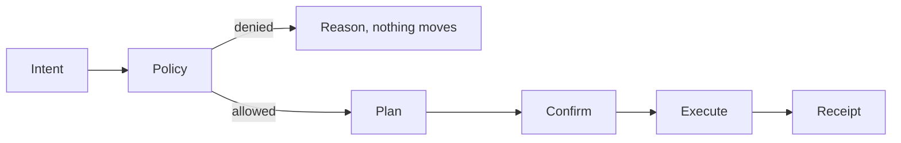
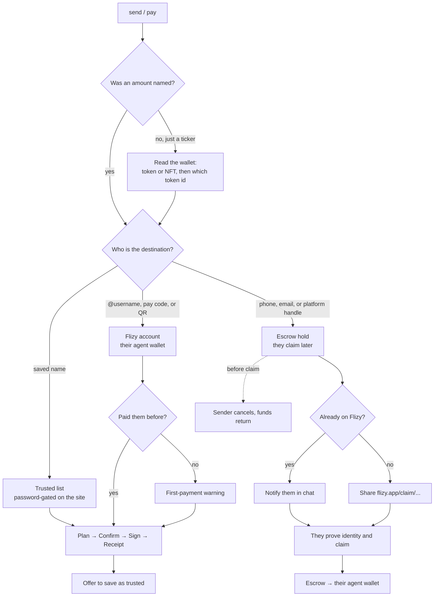
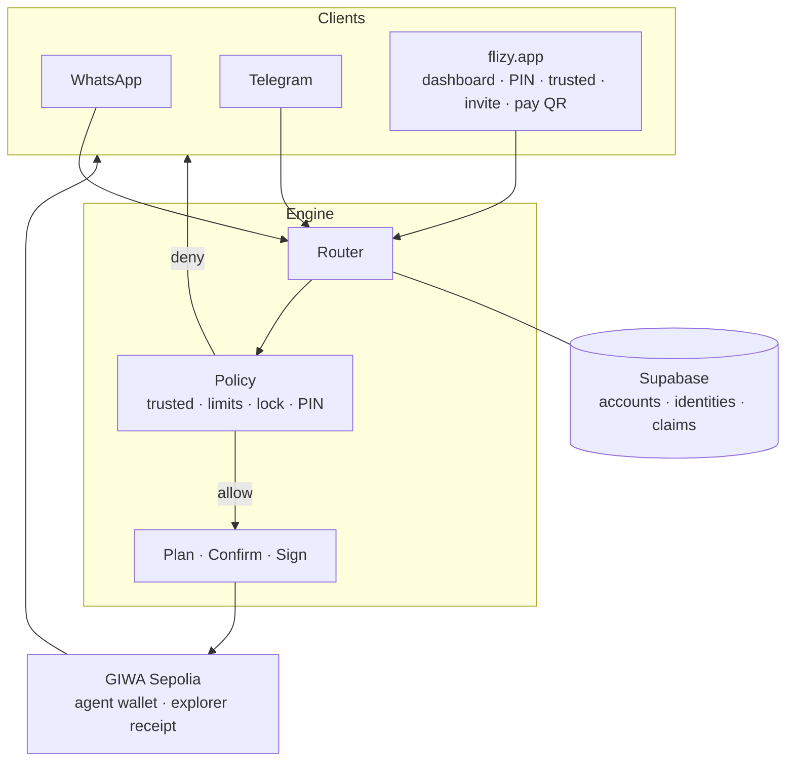
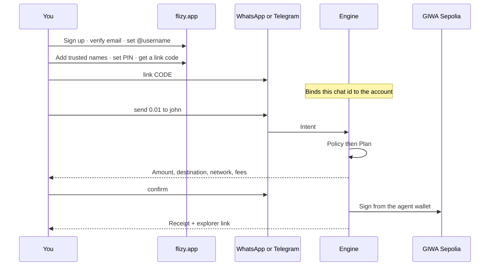

<p align="center">
  
</p>

<h1 align="center">Flizy</h1>

<p align="center">
  <strong>Send crypto the way you send a message.</strong><br />
  WhatsApp or Telegram. Only to people you already approved.<br />
  A stolen phone cannot add a payout address, so it cannot drain you.
</p>

<p align="center">
  <a href="https://flizy.app">flizy.app</a>
  ·
  <a href="https://flizy.app/how-it-works">How it works</a>
  ·
  <a href="https://flizy.app/docs">Security</a>
  ·
  <a href="https://x.com/Flizyapp">X</a>
  ·
  <a href="docs/ARCHITECTURE.md">Architecture</a>
  ·
  <a href="docs/OPERATIONS.md">Operations</a>
</p>

<p align="center">
  Live on <a href="https://flizy.app">flizy.app</a> · GIWA Sepolia · contracts source verified
</p>

---

## Contents

- [What this is](#what-this-is)
- [How money moves](#how-money-moves)
- [System](#system)
- [Security](#security)
- [Using it](#using-it)
- [Commands](#commands)
- [Contracts](#contracts)
- [Repository](#repository)
- [Roadmap](#roadmap)

---

## What this is

Crypto payments assume a laptop, a browser extension, and a seed phrase. Most people who
would actually use them have none of those. The ones who try get drained by one mistake:
a wrong address in a chat, or a phone picked up while unlocked.

Flizy inverts that default.

**Money can only move to a destination you approved earlier, from a device you already
trust.** Approving a new destination requires the website and your account password. Chat
can spend within those rules. It can never rewrite them.

That is the product. Everything below serves it.

| | WhatsApp | Telegram |
| --- | --- | --- |
| Send to a saved name | `flizy send 0.01 to john` | `/send 0.01 to john` |
| Pay a Flizy account | `flizy pay 0.01 to @ludarep` | `/pay 0.01 to @ludarep` |
| Send an NFT you hold | `flizy send giwaforge to john` | `/send giwaforge to john` |
| Send several at once | `flizy send 2 giwaforge to john` | `/send 2 giwaforge to john` |
| Confirm | reply `confirm` | tap Confirm, or type it |
| Receive to your number | automatic once linked | share your number once with `/phone` |
| Lock this device | `flizy lock` | `/lock` |

Same account, same balance, same approved list, same history. Link either chat, or both.
Locking one leaves the other as it was.

Both apps are thin clients on one engine. A message becomes an intent. The engine decides
whether money is allowed to move. A third channel would be another adapter, not a second
product.

---

## How money moves

Every path through Flizy is the same six steps. Chat, the site, and a future channel all
hit this spine. Nothing executes without an explicit confirm.


```mermaid
flowchart LR
  A[Intent] --> B[Policy]
  B -->|denied| X[Reason, nothing moves]
  B -->|allowed| C[Plan]
  C --> D[Confirm]
  D --> E[Execute]
  E --> F[Receipt]
```

From there the destination decides the settlement:


```mermaid
flowchart TB
  START["send / pay"] --> WHAT{Was an amount named?}
  WHAT -->|yes| KIND{Who is the destination?}
  WHAT -->|"no, just a ticker"| READ["Read the wallet:<br/>token or NFT, then which token id"]
  READ --> KIND

  KIND -->|"saved name"| TRUST["Trusted list<br/>password-gated on the site"]
  KIND -->|"@username, pay code, or QR"| ID["Flizy account<br/>their agent wallet"]
  KIND -->|"phone, email, or platform handle"| HOLD["Escrow hold<br/>they claim later"]

  TRUST --> SPINE["Plan → Confirm → Sign → Receipt"]
  ID --> FIRST{Paid them before?}
  FIRST -->|no| WARN["First-payment warning"]
  FIRST -->|yes| SPINE
  WARN --> SPINE
  SPINE --> SAVE["Offer to save as trusted"]

  HOLD --> ON{Already on Flizy?}
  ON -->|yes| NOTE["Notify them in chat"]
  ON -->|no| LINK["Share flizy.app/claim/..."]
  NOTE --> CLAIM["They prove identity and claim"]
  LINK --> CLAIM
  CLAIM --> PAY["Escrow → their agent wallet"]
  HOLD -.->|before claim| CANCEL["Sender cancels, funds return"]
```

A claim is not a bearer link. Payout requires the logged-in account to prove the identity
the hold was addressed to (platform user id, verified phone, or verified email). A
lookalike handle cannot collect.

Every account also has a **Pay me** card: QR plus `@username`. A scan opens
[flizy.app/pay/username](https://flizy.app/pay/ludarep).

---

## System

Clients are adapters. Policy is the only money gate. The chain is infrastructure.


```mermaid
flowchart TB
  subgraph clients["Clients"]
    WA["WhatsApp"]
    TG["Telegram"]
    WEB["flizy.app<br/>dashboard · PIN · trusted · invite · pay QR"]
  end

  subgraph engine["Engine"]
    R["Router"]
    P["Policy<br/>trusted · limits · lock · PIN"]
    X["Plan · Confirm · Sign"]
  end

  DB[("Supabase<br/>accounts · identities · claims")]
  CH["GIWA Sepolia<br/>agent wallet · explorer receipt"]

  WA --> R
  TG --> R
  WEB --> R
  R --> P
  P -->|allow| X
  P -->|deny| clients
  R --- DB
  X --> CH
  CH --> clients
```


```mermaid
sequenceDiagram
  participant U as You
  participant Site as flizy.app
  participant Chat as WhatsApp or Telegram
  participant E as Engine
  participant Chain as GIWA Sepolia

  U->>Site: Sign up · verify email · set @username
  U->>Site: Add trusted names · set PIN · get a link code
  U->>Chat: link CODE
  Note over E: Binds this chat id to the account
  U->>Chat: send 0.01 to john
  Chat->>E: Intent
  E->>E: Policy then Plan
  E-->>U: Amount, destination, network, fees
  U->>Chat: confirm
  E->>Chain: Sign from the agent wallet
  E-->>U: Receipt + explorer link
```

**[flizy.app](https://flizy.app)** is where trust and PIN are managed. Chat is where you
send within those rules. Implementation detail lives in
[docs/ARCHITECTURE.md](docs/ARCHITECTURE.md).

---

## Security

| Control | What it does |
| --- | --- |
| **Approved destinations** | Named address sends reach your trusted list only. The list is managed on the site behind your password, never from chat |
| **Pay by identity** | A Flizy `@username`, pay code, or scanned QR can be paid with confirm. First payment is flagged. After success you can save them |
| **Plan then confirm** | Every money action shows amount, destination, network, and fees first. Nothing executes without confirm |
| **Fees disclosed up front** | Swap plans show the protocol fee percentage, the fee amount, and slippage before you confirm |
| **Per-channel lock** | Lock a chat app instantly. Unlocking needs your PIN or account password. Wrong attempts back off. A new PIN on the site, behind password, clears the block |
| **Limits** | Per-transaction maximum and a daily cap, enforced centrally |
| **Separated keys** | User funds, operational gas, and claim escrow use different keys |
| **Verified contracts** | Every deployed contract is source verified on the public explorer |

The rules live in one policy layer. A new chat app inherits them because it has no way
around them. Allowlist detail: [docs/trusted-addresses.md](docs/trusted-addresses.md).

### Where the product actually is

Being precise about this matters more than sounding finished.

- This is a **testnet product** on GIWA Sepolia. Do not treat it as production custody.
- Agent wallets are currently **server-derived EOAs**. Keys are held server side, so the
  current model is custodial. Do not read that as self-custody.
- `contracts/src/FlizyWallet.sol` is scaffold, not deployed, and **not** the upgrade path.
  Do not extend it. Kernel helpers in this repo are research smokes, not the live engine.
- The approved-destination allowlist is enforced **at the policy layer today**, not yet on
  chain. Moving that onto a smart account is the next security milestone.

---

## Using it

1. **Sign up on the site.** Email, password, then a one-time code to prove the inbox. Set a
   Flizy `@username`. You get an account, an agent wallet, and a personal invite link.
2. **Approve who you can pay.** Add a name and an address under trusted destinations. This
   step needs your password, and it only happens on the site.
3. **Link your chat app.** Generate a one-time code, open WhatsApp or Telegram from the
   dashboard, send the code. Only a logged-in account holder can produce a code.
   Telegram also asks you to share your number once.
4. **Pay from chat.** `flizy send 0.01 to john` for a name you already saved, or
   `flizy pay 0.01 to @ludarep` for a Flizy account. Flizy replies with a plan. Nothing
   moves until you confirm.
5. **Get a receipt** with an explorer link.

You can also send to a **phone number, email, or platform handle** (GitHub, Discord, X,
Telegram). Funds go into escrow. You can cancel until they are claimed. If that person is
already on Flizy they are notified in chat. If not, you share a claim link. Money never
lands in someone's wallet unannounced, and a number that is not on Flizy is never messaged
out of the blue.

**Naming an asset is enough.** `flizy send giwaforge to john` carries no amount and no
token id, so Flizy reads your wallet and asks for whatever is missing: token or NFT if you
hold both, then which token id if you hold several. One NFT and it goes straight to the
plan. Nothing is picked for you, and the plan still names the exact id before you confirm.

**A number in front means how many.** `flizy send 2 giwaforge to john` sends two of them.
An ERC-721 moves one token id per transaction, so two NFTs is two transactions and two
confirms: Flizy names the ids it is about to move, sends the first once you confirm, then
comes straight back for the next. Hold more than you asked for and it lists them so you
choose each one; hold exactly as many and there is nothing to choose. Ask for more than
you have and it sends nothing at all. Name the ids yourself with
`send 2 giwaforge 1123 1128 to john` or `nft send giwaforge 1123 1128 to john`.

Home has an optional **Attach to claims I send** checkbox, off by default. When on, new
holds carry your invite so someone who joins from that claim can count as a referred
friend. How a count is earned: [docs on the site](https://flizy.app/docs#invites).

Used-your-link moves when they sign up through your invite. Credit at the top is the
verified count (phone + first confirmed tx). It is not spendable. One verified phone can
only produce one credit, even after unlink.

---

## Commands

WhatsApp uses the `flizy` prefix. Telegram uses `/command` and also accepts the prefix.
Bare `confirm` and `cancel` work on both.

| Command | Purpose |
|---------|---------|
| `help` | Command list |
| `link CODE` | Bind this chat to your account |
| `me` · `balance` · `deposit` · `history` | Account and wallet |
| `add wallet 0x…` | Start the approved-destination flow |
| `send AMOUNT [FLZ] to name \| phone \| email \| @user on telegram` | Transfer, or hold a claim (ETH default; listed tokens too) |
| `send TICKER to …` | No amount: Flizy reads your wallet and asks token or NFT, then which id. Add `nft` (`send giwaforge nft to …`) to skip straight to the collection |
| `send N TICKER to …` | Send N NFTs from that collection, one confirm each |
| `nft send TICKER ID [ID …] to …` | Send listed NFTs by token id |
| `mint 1 giwaforge` | One test NFT per wallet |
| `claim` · `cancel claims` | Receive or cancel holds |
| `request` · `pay` · `requests` | Payment requests |
| `buy AMOUNT FLZ` · `sell AMOUNT FLZ` | Trade against the pool |
| `swap AMOUNT ETH for FLZ` · `price FLZ` | Explicit swap and spot price |
| `confirm` · `cancel` | Execute or drop the pending plan |
| `lock` · `unlock PIN` | Session control, per channel |
| `/phone` | Telegram only: share your number so claims reach you |

### On the site

| Route | Purpose |
|-------|---------|
| [flizy.app](https://flizy.app/) | Product home |
| [/how-it-works](https://flizy.app/how-it-works) · [/docs](https://flizy.app/docs) | Guides and security |
| [/signup](https://flizy.app/signup) · [/login](https://flizy.app/login) | Account |
| [/dashboard](https://flizy.app/dashboard) | Wallet, invite, history, trusted list, PIN, chat link codes |
| [/dashboard/swap](https://flizy.app/dashboard/swap) | Swap and liquidity |
| `/i/[username]` | Personal invite. Sets attribution, then signup |
| `/claim/[token]/[username]` | Public claim. Trailing username is the invite when the sender opted in |

Swapping is available in chat and on the site. The protocol fee is **0.30%** by default
with a hard maximum of 1%, on top of the standard pool fee, and it is shown in the plan
before you confirm. Details: [docs/swap-fees.md](docs/swap-fees.md).

---

## Contracts

**Network:** GIWA Sepolia · **Chain ID:** `91342`
**Explorer:** [sepolia-explorer.giwa.io](https://sepolia-explorer.giwa.io)
**Addresses:** [`deployments/giwa-sepolia.json`](deployments/giwa-sepolia.json)

| Contract | Address | Explorer | Source |
|----------|---------|----------|--------|
| **WETH9** | `0x3a13399f2741122B63c7710B2A85346B97C6BFDf` | [View](https://sepolia-explorer.giwa.io/address/0x3a13399f2741122B63c7710B2A85346B97C6BFDf) | Verified |
| **FLZ** (test token, 100k supply, 18 decimals) | `0x308be8f71DA695f18E70D2243A446e1fD1566BA6` | [View](https://sepolia-explorer.giwa.io/address/0x308be8f71DA695f18E70D2243A446e1fD1566BA6) | Verified |
| **UniswapV2Factory** | `0xBB1d2c582E455B448660A199097A54DF29162BbF` | [View](https://sepolia-explorer.giwa.io/address/0xBB1d2c582E455B448660A199097A54DF29162BbF) | Verified |
| **UniswapV2Router02** | `0x4055413A4757e069bbCAc481639EF2814224Faa0` | [View](https://sepolia-explorer.giwa.io/address/0x4055413A4757e069bbCAc481639EF2814224Faa0) | Verified |
| **FlizyFeeRouter** (protocol fee, default 30 bps, max 100 bps) | `0x6427fD0c13577847888B7E2d1A24C887bBEBd9cC` | [View](https://sepolia-explorer.giwa.io/address/0x6427fD0c13577847888B7E2d1A24C887bBEBd9cC) | Verified |
| **FLZ / WETH pair** | `0xEC6Ebf4A7a3088EB22535C9F767B9Ab5845D8227` | [View](https://sepolia-explorer.giwa.io/address/0xEC6Ebf4A7a3088EB22535C9F767B9Ab5845D8227) | Verified |

All six are source verified as a full match, built with `v0.8.24+commit.e11b9ed9`, optimizer
on at 200 runs, EVM version cancun. This is a Solidity 0.8 port of Uniswap V2, so factory,
pair and router build on one compiler rather than the canonical 0.5.16 / 0.6.6 split.

**Treasury / fee destination:** [`0x81Fb7Ed21B9843D2D5C232A7F3e959F91993401B`](https://sepolia-explorer.giwa.io/address/0x81Fb7Ed21B9843D2D5C232A7F3e959F91993401B)
**Seed liquidity:** 1.2 ETH and 60,000 FLZ, starting near 50,000 FLZ per ETH.

Also in the repository, not live custody:

| Item | Path | Status |
|------|------|--------|
| FlizyWallet | `contracts/src/FlizyWallet.sol` | Scaffold. Not deployed. Do not extend |
| FlizyWalletFactory | `contracts/src/FlizyWalletFactory.sol` | Same. Do not deploy for users |
| Kernel v3.3 smoke | `lib/smartAccount.js`, `deployments/giwa-sepolia-kernel.json` | Research only. Not the live engine |
| P-256 / WebAuthn on GIWA Sepolia | `docs/PASSKEY-P256-GIWA.md` | Measured. RIP-7212 at 0x100 is a real verifier |

---

## Repository

```text
index.js · telegram.js    chat clients (adapters)
lib/                      router, policy, identity, claims, swap
web/                      Next.js site and dashboard
contracts/                Solidity sources and Foundry tests
supabase/migrations/      database schema
deployments/              live addresses (DEX) and Kernel research pin
docs/                     architecture, operations, fee mechanics
```

Configuration is documented in [`.env.example`](.env.example).

### Quickstart

```bash
npm install
cp .env.example .env    # fill in your values
npm start               # WhatsApp client
npm run start:telegram  # Telegram client
npm test
```

Full setup, deployment and configuration: [docs/OPERATIONS.md](docs/OPERATIONS.md).

---

## Roadmap

| Horizon | Focus |
|---------|-------|
| **Now** | GIWA Sepolia: chat payments, identity claims (phone, email, GitHub, Discord, X, Telegram), identity send for listed tokens and NFTs on the same escrow, invites with a phone-permanence count, FLZ swap and liquidity, both chat apps on one engine |
| **Next** | A smart-account path so testers move off derived EOAs, with the policy gate unchanged |
| **Then** | More tokens through the pair registry, then more EVM chains through the chain registry. Same policy path, no new AMM |

---

## License and contact

Private product repository. Live at [flizy.app](https://flizy.app). On X: [@Flizyapp](https://x.com/Flizyapp).
