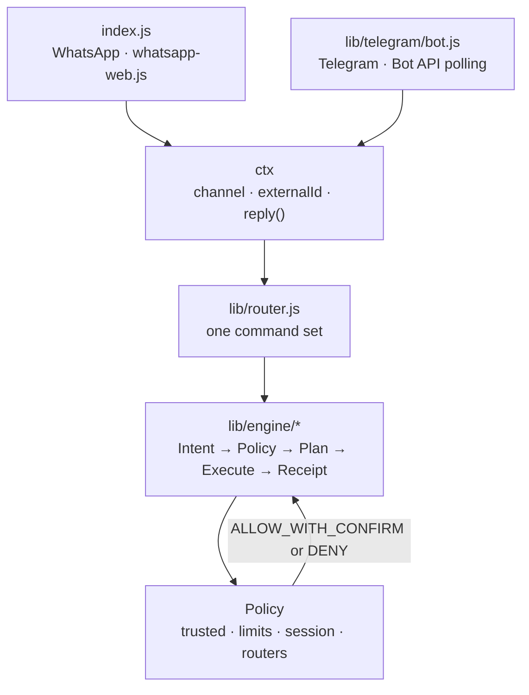
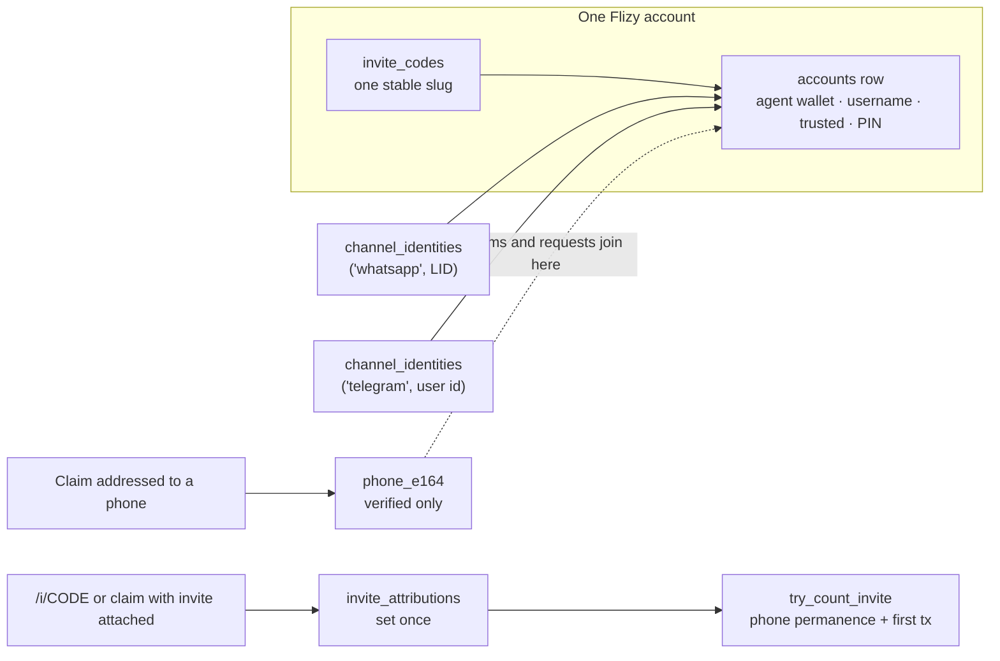
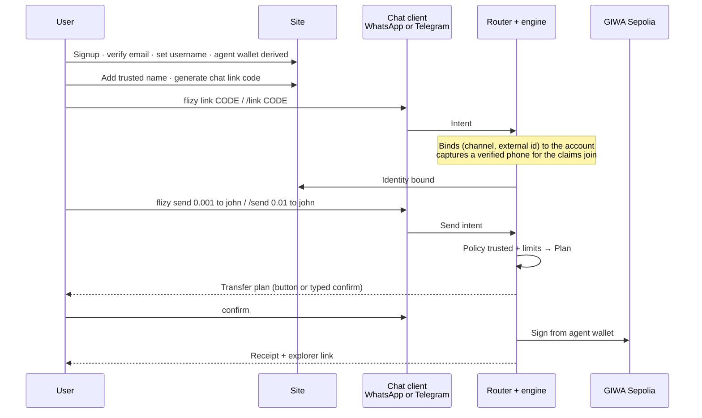
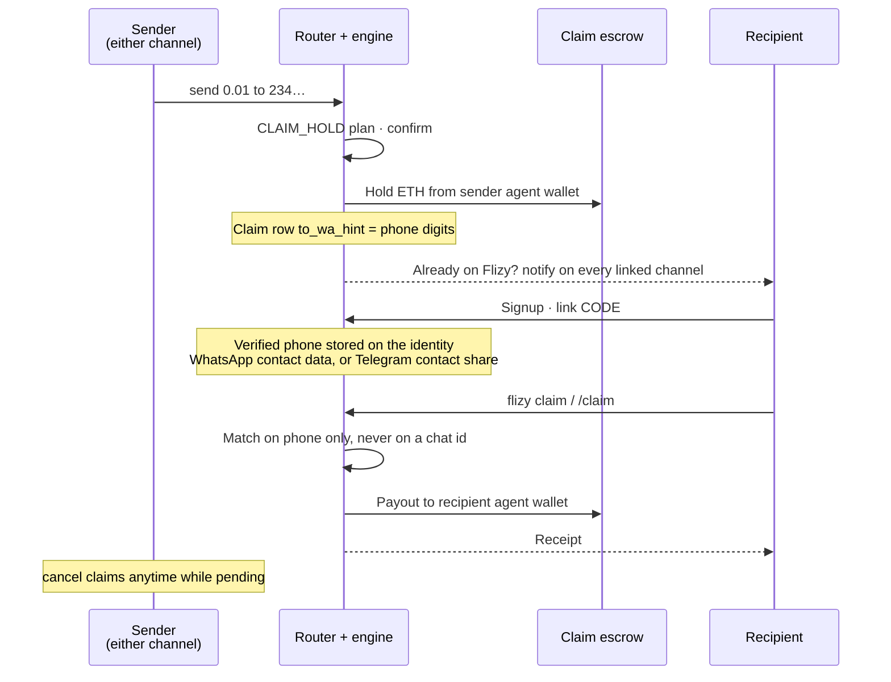
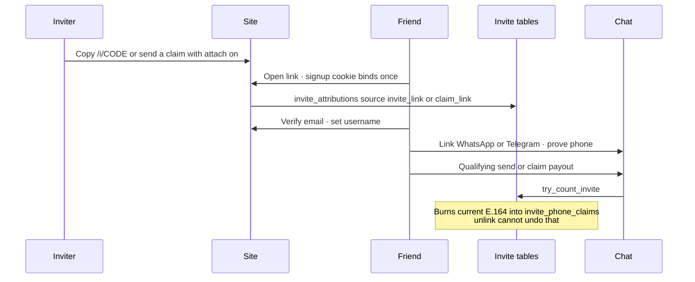
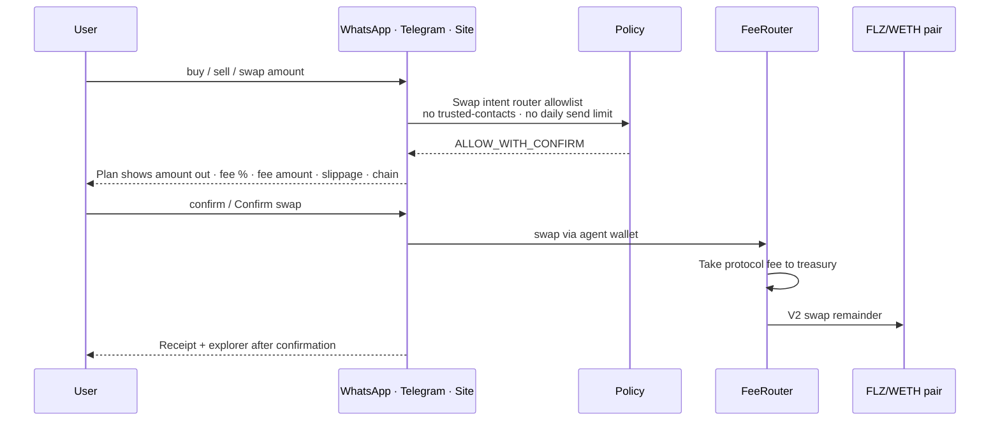
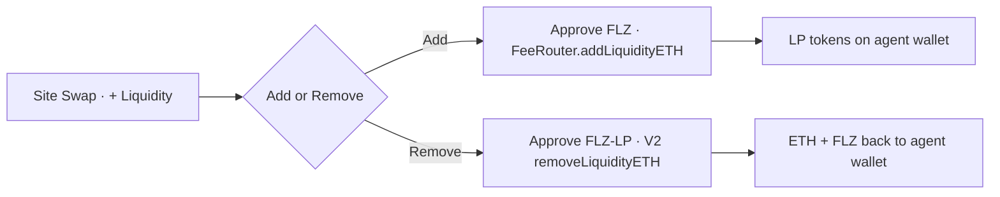

# Architecture

Implementation detail for contributors. The product overview and conceptual diagrams are in
the [README](../README.md). Deployment and configuration: [OPERATIONS.md](OPERATIONS.md).

**Hard rule:** clients are adapters. Policy is the only money/safety enforcement. The engine
is the product. Product strategy and roadmap notes stay private (local `docs/` / `tasks/`), not
in the public tree.

---

## Component map

```text
                    +------------------------+
                    |   flizy.app            |
                    |  dashboard · swap UI   |
                    |  invite · liquidity    |
                    +-----------+------------+
                                |
                                v
                    +--------------------------+
                    |        Supabase          |
                    | accounts · identities    |
                    | (channel, external id)   |
                    | trusted · claims · txs   |
                    | invite codes · count     |
                    +-----------+--------------+
                                ^
                                |
  +------------+       +--------+--------+         +------------------+
  | WhatsApp   | ----> |  Flizy engine   | ----->  | Agent wallets    |
  | Telegram   |       |  Policy + Plan  |  sign   | (per account)    |
  +------------+       +--------+--------+         +--------+---------+
                                |                           |
                     ops / treasury / escrow                v
                                                    GIWA Sepolia DEX
                                                    FeeRouter -> V2 -> Pair
```

---

## Clients are adapters

A chat client translates an inbound message into a `ctx` and hands it to `lib/router`,
which owns every command. Money rules live only in `lib/engine`. Adding a channel means
adding an adapter, not a second copy of the product.



The `ctx` an adapter must supply:

```js
{
  channel,               // 'whatsapp' | 'telegram'
  externalId,            // chat identity on that channel
  key,                   // `${channel}:${externalId}`, used for pending flows
  reply(text, opts),     // opts.buttons is optional
  requestPhone(text),    // optional, channels that can verify a number
  resolveVerifiedPhone(),// optional, channels that expose one already
  raw,                   // underlying message object, never used for logic
}
```

| | WhatsApp | Telegram |
| --- | --- | --- |
| Process | `node index.js` (`flizy.service`) | `node telegram.js` (`flizy-telegram.service`) |
| Transport | whatsapp-web.js plus headless Chromium | Bot API long polling, no browser |
| Invocation | `flizy <command>` | `/command` (the `flizy ` prefix also works) |
| Confirm | type `confirm` | inline button, or type `confirm` |
| Phone for claims | read from WhatsApp contact metadata | one-tap contact share (`/phone`) |

---

## Identity model

An account can hold a WhatsApp identity and a Telegram identity at once. One phone maps to
exactly one account across every channel, checked in the application for a clear message and
enforced again by a database trigger.



Two rules do the heavy lifting:

- The chat id identifies the **session**. The phone identifies the **claim address**. They
  are never interchangeable, so a Telegram user id can never match a stranger's claim.
- A phone is only accepted from a channel-verified source: WhatsApp contact metadata, or a
  Telegram contact share where `contact.user_id` equals the sender. A typed number is never
  a claim key.

### Storage detail

- Identity is **(channel, external id)** in `channel_identities`. WhatsApp stores the
  observed sender id (**LID-first**), Telegram stores the numeric user id.
- The claims and requests join key is `channel_identities.phone_e164`, normalized digits.
- `transfers.phone` holds an identity transfer key: the bare id for WhatsApp so historic
  rows still match, and a namespaced `telegram:<id>` for other channels so a chat id can
  never collide with somebody's phone number.
- **A phone column never receives a transfer key.** `normalizePhoneNumber` rejects any value
  containing a letter rather than salvaging its digits, because stripping the namespace off
  `telegram:5566778899` would forge a plausible number out of a chat user id. That forged
  number could then match an `ADMIN_PHONES` entry or a stranger's pending claim. Columns
  rendered back to a user as a phone (`claims.from_wa_sender`, `payment_requests.requester_wa`)
  additionally store `null` unless the value passes `isPlausiblePhone`.
- Sessions are keyed `(account_id, channel, external_id)`. Locking one chat app leaves the
  other untouched.
- Agent wallets are derived once per account (v2: HMAC-SHA256 of the account id under
  `WALLET_DERIVATION_SECRET`, then keccak256). They are never rotated, so the site and every
  chat client always show the same address.
- Invites: `invite_codes` is one unguessable slug per account. Attribution is set once on
  signup from an httpOnly cookie (invite link or an opted-in claim). A count is written by
  `try_count_invite` only after onboarding, a currently bound verified phone, and a
  qualifying first tx. `invite_phone_claims` remembers that E.164 forever so unlink cannot
  recycle a SIM for a second credit. FZ001 still only governs live binds.

---

## End-to-end flows

### Account link and send



The client differs only in how the message arrives and how the confirm is tapped. The
Intent, the Policy decision, the Plan and the receipt are the same objects either way.

### Phone claim (escrow)



If the sender has **Attach to claims I send** on, the hold snapshots their invite code.
Opening `/claim/{token}` sets the same attribution cookie as `/i/{code}`. Money still
settles claim-first; the invite is attribution only.

### Invite count



### Swap



Swaps deliberately skip the approved-destination check and the daily send limit: funds move
to an allowlisted router and stay in the user's own agent wallet as a different asset. Only
transfers and claims consume the daily send budget.

### Liquidity (site only)



---

## Cross-channel notifications

`lib/notify.js` fans a message out to every identity on an account. A process delivers
inline for channels it owns and queues the rest in a `notifications` outbox table, which the
owning process drains every `OUTBOX_DRAIN_MS`.

Telegram delivery is a stateless HTTPS call, so **both** processes register a Telegram
sender when `TELEGRAM_BOT_TOKEN` is present, and a WhatsApp-originated notice reaches a
Telegram user immediately rather than waiting for a poll. Only the Telegram process
registers the *drain*, so a queued message is never delivered twice. WhatsApp needs the live
web session, so that direction still queues.

Used when a claim is held for a number that already belongs to a Flizy account, and when a
payment request is created. Numbers that are not on Flizy are never cold-messaged: the
sender shares a claim link instead.

---

## Engine pipeline (Intent → Policy → Route → Execute → Receipt)

Canonical money path lives under `lib/engine/`. Clients and HTTP handlers must not invent a
parallel path.

| Step | Responsibility | Primary code |
|------|----------------|--------------|
| **Intent** | Structured “what the user wants” | `lib/engine/intent.js` |
| **Policy** | Allow / deny / confirm; trusted, limits, session, routers | `lib/engine/policy.js` |
| **Plan** | Human-readable preview before money moves | `lib/engine/plan.js` |
| **Route** | Which backend (agent wallet, escrow, DEX, later partner) | policy + execute helpers, `lib/chains.js`, `lib/dex.js` |
| **Execute** | Sign and settle | `lib/engine/executeTransfer.js`, `executeClaim.js`, `executeSwap.js` |
| **Receipt** | Status, hash/ref, explorer, notify | `lib/engine/receipt.js`, transfer log, claim rows |

Target shape for any new money move:

```ts
execute({
  actor,
  intent,   // send | claim | swap | request | pay | …
  asset?,
  amount?,
  currency?,
  recipient?, // name | phone | platform id | address (advanced)
  meta?,
})
```

Caller does not choose ERC-20 vs bank vs Uniswap. Route does.

---

## Wallets and keys

| Wallet | Role |
|--------|------|
| **Agent wallet** | Per-account funds for normal sends; derived once per account, never rotated for address stability |
| **Ops** (`PRIVATE_KEY`) | Infra / gas only — not user escrow |
| **Escrow** (`ESCROW_PRIVATE_KEY` or derived) | Pending claim liability only |

Invariant:

```text
escrow_on_chain_balance >= sum(pending claims amount)  (+ gas for next payout)
```

Hold: agent → escrow. Cancel: escrow → sender agent. Claim: escrow → recipient agent.

Smart wallet contracts (`contracts/src/FlizyWallet*.sol`) exist in-repo for a future on-chain
allowlist / session-key path. They are **not** live custody today. Production custody upgrade
is roadmap Stage 7 — not an architecture rewrite of the engine.

---

## HTTP API (web)

Next.js App Router under `web/app/api/`. Each route is a **client** of domain logic (web
mirrors of pure helpers, or shared rules). Money rules still belong in Policy/engine, not in
the route handler body beyond orchestration.

Representative surfaces:

| Area | Routes (illustrative) |
|------|------------------------|
| Auth | signup, login, GitHub OAuth start/callback |
| Session / PIN | pin, dashboard cookie session |
| Identity | `/api/identity`, link code create |
| Money | claim token, withdraw, swap quote/execute, trusted |
| Read | dashboard, history, holdings, limits |

Errors: prefer `web/lib/apiError.ts` patterns — no secret leakage, fail closed.

### Dashboard shell layout

The authenticated surface (Home / Wallet / Swap / History / Account) shares one
shell that owns the viewport height and pins the bottom nav. Its structural
contract — and the rules that silently break it, chiefly **no transform,
filter or backdrop-filter on any ancestor of the fixed nav** — is in
[app-shell-layout.md](app-shell-layout.md). Read it before changing
`DashboardGate`, `AppSection`, `AppChrome` or `AppBottomNav`, or before adding
a page-level animation.

---

## Future authenticated Engine API

Not shipped as a public product yet (roadmap Stage 6). Target:

- Auth’d, scoped keys call the same Intent → Policy → Plan → Execute → Receipt pipeline
- Delegated caps (e.g. trade under limit; withdraw denied by default)
- Webhooks for plan / receipt
- AI and third parties are adapters on this API, never second engines

Until then, do not grow ad-hoc server actions that bypass Policy.

---

## Security (technical)

- Trusted destinations mutated only with password on web; chat cannot expand allowlist
- Session lock per `(account, channel, external_id)`; PIN ladder / lockout tables
- Daily and per-tx limits in Policy
- Channel and external id normalization fail closed; phones never forged from chat ids
- Claim match keys: verified phone or platform id — not display handles
- Separated agent / ops / escrow keys
- Link codes and OAuth binds: attempt limiting / lockout ladders where secrets are guessable
- No secrets in client error bodies or logs

Allowlist product rules: [trusted-addresses.md](trusted-addresses.md).

---

## Chain and token registry

Flizy is GIWA-first through `lib/chains.js`, default `giwa_sepolia` / `91342`. Adding an EVM
chain means registering an RPC, explorer, fee router and token addresses. The Intent,
Policy, Plan and Execute path does not change.

Contract addresses and the verification record live in
[`deployments/giwa-sepolia.json`](../deployments/giwa-sepolia.json). Fee mechanics are in
[swap-fees.md](swap-fees.md).
